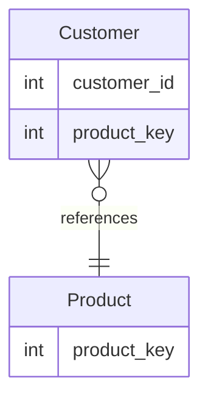

# leet : 1045. Customers Who Bought All Products
* [[leet : 1045. Customers Who Bought All Products]](https://leetcode.com/problems/customers-who-bought-all-products/description/)
<br>

---

### **다이어그램**


### **다이어그램**
> `PRODUCT를 모두 구매한 고객 구하기`

<br>

## 문제 풀이

### **MySQL**
```SQL
-- Solution 1
WITH NO_DUP AS (
    SELECT DISTINCT * FROM CUSTOMER
)

SELECT CUSTOMER_ID
FROM (
    SELECT *, COUNT(*) AS CNT
    FROM NO_DUP
    GROUP BY CUSTOMER_ID
    HAVING CNT = (SELECT COUNT(*) FROM PRODUCT)
    ) AS ALL_PRODUCT

-- Solution 2
WITH TEMP AS (
    SELECT DISTINCT C.CUSTOMER_ID, P.PRODUCT_KEY
    FROM PRODUCT P
    LEFT JOIN CUSTOMER C ON P.PRODUCT_KEY = C.PRODUCT_KEY
)

SELECT CUSTOMER_ID
FROM TEMP
GROUP BY CUSTOMER_ID
HAVING COUNT(*) = (SELECT COUNT(*) FROM PRODUCT)
```
* Solution 1
  * HAVING절에 서브쿼리 두 개로 비교하는게 가독성이 더 좋았을 듯 하다.
  * 조건에 CUSTOMER TABLE에 중복 튜플이 존재할 수 있다고 해서 중복 제거해줘야함
  
* Solution 1
  * DISTINCT + LEFT JOIN으로 몇개나 겹치는지 확인
  * HAVING으로 PRODUCT 개수랑 맞는지 확인하기
  
### **Pandas**
```python
def find_customers(customer: pd.DataFrame, product: pd.DataFrame) -> pd.DataFrame:
    n = len(product)
    customer.drop_duplicates(subset=['customer_id','product_key'], inplace=True)
    count = customer.groupby(['customer_id']).size().reset_index(name='count')
    return count[count['count']==n][['customer_id']]
```
* Solution 1
  * SQL이랑 같은 방법으로 중복제거 후 GROUP BY로 묶어주고 PRODUCT의 튜플수랑 일치하면 정답 반환한다.
  
<br>

### **코멘트**
* 쉬운문제