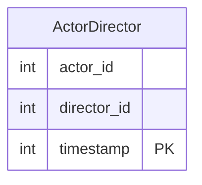

# leetcode : 1050. Actors and Directors Who Cooperated At Least Three Times
* [[leetcode : 1050. Actors and Directors Who Cooperated At Least Three Times]](https://leetcode.com/problems/actors-and-directors-who-cooperated-at-least-three-times/description/)
<br>

---

### **다이어그램**


### **목표**
> `3번 이상 등장한 actor director 쌍 목록 구하기`


<br>

## 문제 풀이

### **MySQL**
```SQL
-- Solution 1
SELECT ACTOR_ID, DIRECTOR_ID
FROM (
    SELECT *, COUNT(*) AS CNT
    FROM ActorDirector
    GROUP BY ACTOR_ID, DIRECTOR_ID
    HAVING CNT >= 3) AS OVER_THREE

-- Solution 2
SELECT ACTOR_ID, DIRECTOR_ID
FROM ActorDirector 
GROUP BY ACTOR_ID, DIRECTOR_ID
HAVING COUNT(*) >= 3
```

* Solution 1:
  * 풀고보니 서브쿼리 안쓰고 바로 HAVING절에서 처리할 수 있었다.
  
* Solution 2:
  * groupby + having


### **Pandas**
```python
# Solution 1
def actors_and_directors(actor_director: pd.DataFrame) -> pd.DataFrame:
    count = actor_director.groupby(['actor_id','director_id']).size().reset_index(name='count')
    return count[count['count']>=3][['actor_id','director_id']]

# Solution 2
def actors_and_directors(actor_director: pd.DataFrame) -> pd.DataFrame:
    df = actor_director.groupby(['actor_id', 'director_id']).count().reset_index().rename(columns={'timestamp': 'count'})
    return df[df['count']>=3][['actor_id', 'director_id']]
```

* size와 count의 차이.
* null값 포함 미포함 유무 이외에 name 할당에서 차이가 있다.
  
* Solution 1: size
  * size는 시리즈 반환, count는 데이터 프레임을 반환한다.
  * size는 시리즈 컬럼명이 없기 때문에 바로 name을 할당 가능하다.

* Solution 2: count
  * count는 데이터프레임 컬럼명이 있어서 reset_index를 하면 남아있는 집계 컬럼 timestamp에 카운팅이 되고, 이를 count로 바꿔준다.
  
<br>

### **코멘트**
* 쉬운 문제
