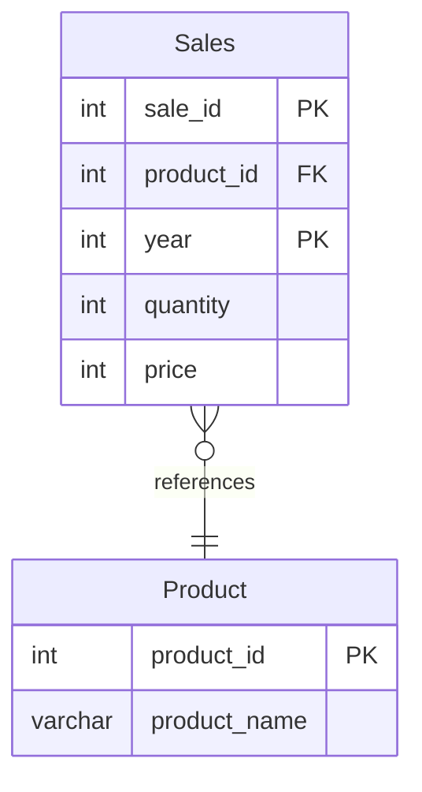

# leetcode : 1068. Product Sales Analysis I
* [[leetcode : 1068. Product Sales Analysis I]](https://leetcode.com/problems/product-sales-analysis-i/description/)
<br>

---

### **다이어그램**


### **목표**
> `id별로 이름,년도,가격 구하기`


<br>

## 문제 풀이

### **MySQL**
```SQL
-- Solution 1
SELECT P.PRODUCT_NAME, S.YEAR, S.PRICE
FROM SALES AS S
JOIN PRODUCT AS P ON S.PRODUCT_ID = P.PRODUCT_ID

-- Solution 2
SELECT P.PRODUCT_NAME, S.YEAR, S.PRICE
FROM SALES AS S
LEFT JOIN PRODUCT AS P ON S.PRODUCT_ID = P.PRODUCT_ID
```

* 조인해주고 컬럼 선택해서 뽑아주기.
  
### **Pandas**
```python
# Solution 1
def sales_analysis(sales: pd.DataFrame, product: pd.DataFrame) -> pd.DataFrame:
    join = sales.merge(product, on='product_id', how='left')
    return join[['product_name','year','price']]

# Solution 2
def sales_analysis(sales: pd.DataFrame, product: pd.DataFrame) -> pd.DataFrame:
    merged = pd.merge(sales, product, on='product_id')
    return merged[['product_name','year','price']]
```

* Solution 1
  * join을 한 테이블을 만들어주고 원하는 컬럼만 뽑는 문제
  * on에 공통 컬럼 안적어도 되는데, 기준이 없으면 테이블 컬럼에 접근 후 탐색해서 시간이 추가적으로 걸린다.
  * 웬만하면 컬럼에 조인 컬럼 명시해주기.
  
* Solution 2
  * how를 적지 않은 경우.
  * 모든 컬럼을 가져와서 메모리적으로 손해가 있다.
  
<br>

### **코멘트**
* 쉬운 문제
