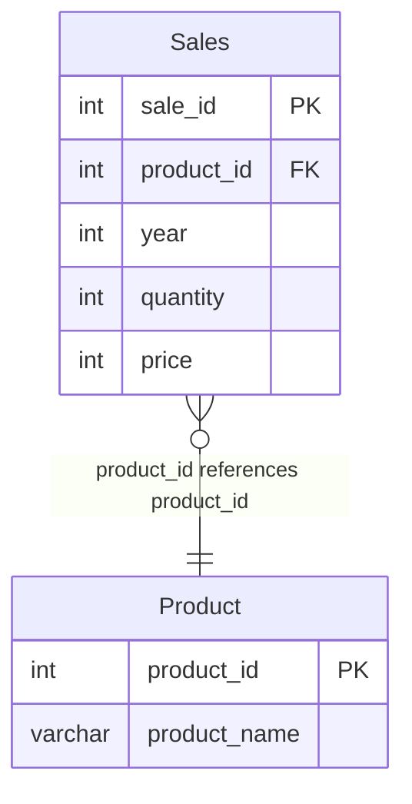

# leetcode : 1070. Product Sales Analysis III
* [[leetcode : 1070. Product Sales Analysis III]](https://leetcode.com/problems/product-sales-analysis-iii/description/)
<br>

---

### **다이어그램**


### **목표**
> `각 제품의 첫 정보 불러오기`

<br>

## 문제 풀이

### **MySQL**
```SQL
SELECT S.PRODUCT_ID, S.YEAR AS FIRST_YEAR, S.QUANTITY, S.PRICE
FROM SALES AS S
JOIN (
    SELECT PRODUCT_ID, MIN(YEAR) AS FIRST_YEAR
    FROM SALES
    GROUP BY PRODUCT_ID
) TEMP
ON S.PRODUCT_ID = TEMP.PRODUCT_ID AND S.YEAR = TEMP.FIRST_YEAR;

```

* 각 상품별 가장 작은 YEAR을 뽑아내는 TEMP 쿼리를 작성한다.
* 원래 있던 SALES와 다시 PRODUCT ID로 JOIN 시켜주면 끝.
  
### **Pandas**
```python
# Solution 1
def sales_analysis(sales: pd.DataFrame, product: pd.DataFrame) -> pd.DataFrame:
    grouped = sales.groupby('product_id')['year'].agg('min').reset_index()
    answer = pd.merge(sales,grouped, on=['product_id','year'], how='inner')
    answer.rename(columns={'year':'first_year'}, inplace=True)
    return answer[['product_id','first_year','quantity','price']]

# Solution 2
def sales_analysis(sales: pd.DataFrame, product: pd.DataFrame) -> pd.DataFrame:
    sales = (sales.sort_values(by=['product_id','year'], ascending=[True,True])
                    .drop_duplicates(subset=['product_id'], keep='first')
                    .rename(columns={'year':'first_year'}))
    return sales[['product_id','first_year','quantity','price']]
```

* Solution 1
  * produt_id에 대해서 group by 진행하고, yaer에 대해서 agg 진행하기.
  * join을 통해서 조건에 맞는 row를 sales에서 꺼내온다.
    
* Solution 2 : sort_values + drop_duplicates
  * 정렬 후 프로덕트의 가장 작은 년도만 불러오기.
  * 틀릴 이유는 없는데, 이 문제만 통과가 안된다... 게시판봐도 같은 문제가 생긴듯

<br>

### **코멘트**
* .