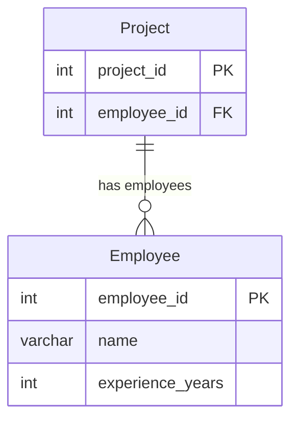

# leetcode : 1075. Project Employees I
* [[leetcode : 1075. Project Employees I]](https://leetcode.com/problems/project-employees-i/description/)
<br>

---

### **다이어그램**


### **목표**
> `프로젝트 별 평균 근속년수 구하기`


<br>

## 문제 풀이

### **MySQL**
```SQL

SELECT PROJECT_ID, ROUND(AVG(EXPERIENCE_YEARS),2) AS AVERAGE_YEARS
FROM (
    SELECT P.PROJECT_ID, E.EXPERIENCE_YEARS
    FROM PROJECT AS P
    JOIN EMPLOYEE AS E ON P.EMPLOYEE_ID = E.EMPLOYEE_ID) AS TEMP
GROUP BY PROJECT_ID
```

* 서브쿼리에서 JOIN을 통해서 PROJECT에 투입된 사람의 연차가 얼마인지 모두 구한다.
* PROJECT별로 GROUP BY + AVG를 진행한다.
  
### **Pandas**
```python
# Solution 1
def project_employees_i(project: pd.DataFrame, employee: pd.DataFrame) -> pd.DataFrame:
    join = pd.merge(project, employee, on='employee_id')
    answer = join.groupby('project_id').agg({'experience_years': 'mean'}).reset_index()
    answer.rename(columns={'experience_years':'average_years'},inplace=True)
    answer['average_years'] = round(answer['average_years'],2)
    return answer

# Solution 2
def project_employees_i(project: pd.DataFrame, employee: pd.DataFrame) -> pd.DataFrame:
    merged = pd.merge(project, employee, on='employee_id')
    grouped = merged.groupby('project_id').agg(
                average_years = ('experience_years','mean')).reset_index()
    grouped['average_years'] = grouped['average_years'].round(2)
    return grouped[['project_id','average_years']]
```

* Solution 1
  * 같은 방식으로 join을 통해서 project에 투입된 사람의 연차를 모두 매칭시킨다.
  * agg를 통해서 평균값을 모두 구해주고 컬럼명, 포매팅 해주면 끝
  
* Solution 2
  * agg를 다른 방식으로 할당할 수 있다.
  * 새로운 컬럼명을 지정하면서 변환시킬 때, 딕셔너리 말고 할당 + 튜플로 전달해주면 된다.
  * 다중 컬럼에 대해서 다중 집계를 할 때, sol1 처럼 key = [agg1, agg2] 이런식으로 쓰는게 더 낫긴 하다.
    
<br>

### **코멘트**
* .
