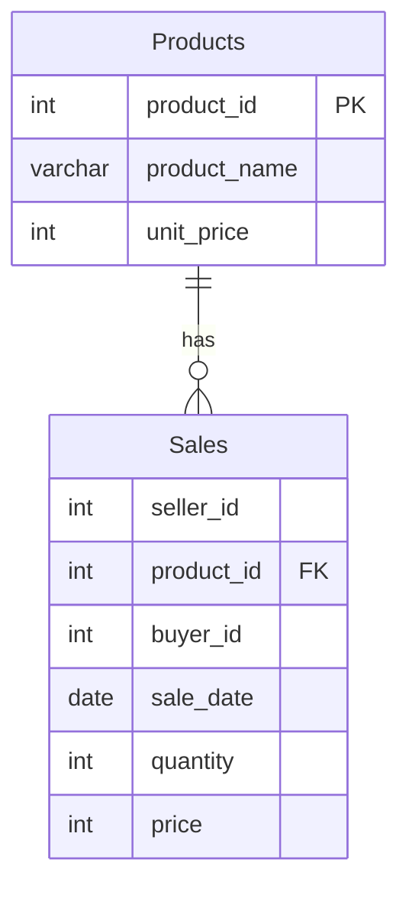

# leetcode : 1084. Sales Analysis III
* [[leetcode : 1084. Sales Analysis III]](https://leetcode.com/problems/sales-analysis-iii/description/)
<br>

---

### **다이어그램**


### **목표**
> `2019 1분기에만 팔린 제품 구하기`

<br>

## 문제 풀이

### **MySQL**
```SQL
-- Solution 1
SELECT P.PRODUCT_ID, P.PRODUCT_NAME
FROM PRODUCT AS P
JOIN (
    SELECT PRODUCT_ID, MIN(SALE_DATE) AS MIN_DATE, MAX(SALE_DATE) AS MAX_DATE
    FROM SALES
    GROUP BY PRODUCT_ID) AS T
ON P.PRODUCT_ID = T.PRODUCT_ID
WHERE T.MIN_DATE >= '2019-01-01' AND T.MAX_DATE <= '2019-03-31';

# Solution 2
WITH Q1 AS (
    SELECT PRODUCT_ID
    FROM SALES
    GROUP BY PRODUCT_ID
    HAVING MIN(SALE_DATE) >= '2019-01-01' AND MAX(SALE_DATE) <= '2019-03-31'
)

SELECT PRODUCT_ID, PRODUCT_NAME
FROM PRODUCT
WHERE PRODUCT_ID IN (SELECT PRODUCT_ID FROM Q1)
```

* Solution 1
  * 각 상품의 DATE의 MIN MAX를 구한 후, 이 테이블과 조인한다.
  * 이후 날짜만 체크해주면 끝.
  
* Solution 2
  * CTE 만들어서 in 사용해주기.
  
### **Pandas**
```python
# Solution 1
def sales_analysis(product: pd.DataFrame, sales: pd.DataFrame) -> pd.DataFrame:
    grouped = sales.groupby('product_id').agg(
        min_date = ('sale_date','min'),
        max_date = ('sale_date','max')
    ).reset_index()
    q1 = grouped[(grouped['min_date']>='2019-01-01') & (grouped['max_date']<='2019-03-31')]
    answer = pd.merge(product, q1, on='product_id')
    return answer[['product_id','product_name']]
```

* Solution 1
  * SQL과 같은 방식으로 grouped 테이블을 만들어서 날짜의 최대 최소를 구한다.
  * JOIN 시켜준 후, 날짜 체크해주기
  
<br>

### **코멘트**
* 코드들 보면 대체로 inner join 사용하는 코드들이 성능이 높은 것 같다.
* agg에 딕셔너리로 전달하기 보다는, 컬럼명을 미리 지정하고 튜플로 전달하는게 더 나은 듯
* 다른 사람들 보니까, 조건 만족하는 id만 구해놓고 isin으로 푸는 풀이도 많이 보인다.
