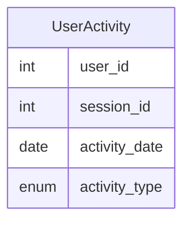

# leetcode : 1141. User Activity for the Past 30 Days I
* [[leetcode : 1141. User Activity for the Past 30 Days I]](https://leetcode.com/problems/user-activity-for-the-past-30-days-i/description/)
<br>

---

### **다이어그램**


### **목표**
> `2019 1분기에만 팔린 제품 구하기`

### **MySQL**
```SQL
-- Solution 1
WITH GROUPED AS (
    SELECT ACTIVITY_DATE AS `DAY`, COUNT(DISTINCT USER_ID) AS ACTIVE_USERS
    FROM ACTIVITY
    GROUP BY ACTIVITY_DATE
)

SELECT *
FROM GROUPED
WHERE `DAY` BETWEEN DATE_SUB('2019-07-27', INTERVAL 29 DAY) AND '2019-07-27'
```

* Solution 1 : GROUPBY DISTINCT + DATE_SUB
  * GROUP BY DISTINCT로 날짜 별 인원을 구해준다.
  * DATE_ADD/SUB로 시작날짜 구해주기

### **Pandas**
```python
def user_activity(activity: pd.DataFrame) -> pd.DataFrame:

    end = pd.to_datetime('2019-07-27')
    start = end - timedelta(days=29)
    temp = activity[activity['activity_date'].between(start,end)]
    answer = (temp.groupby('activity_date').agg(
                        active_users=('user_id','nunique'))
                        .reset_index()
                        .rename(columns={'activity_date':'day'}))
    return answer

def user_activity(activity: pd.DataFrame) -> pd.DataFrame:

    end = pd.to_datetime('2019-07-27')
    start = end - timedelta(days=29)
    grouped = activity.groupby('activity_date').agg(
        active_users=('user_id','nunique')
    ).reset_index()
    return grouped[grouped['activity_date'].between(start,end)].rename(columns={'activity_date':'day'})
```

* Solution 1
  * 같은 방식으로 날짜 29일을 빼주고 between 적용
  * agg 집계함수에 n unique를 써준다.
  * count + distinct느낌
* Solution 2
  * 먼저 group에 unique를 하고 날짜 조건을 걸어주면 조금 더 빠르게 풀 수 있다.
  
<br>

### **코멘트**
* 날짜는 실제 데이터에서 자주 나와서 기억해야함
* DATE_ADD/SUB, timedelta
* DATEDIFF(date1, date2), TIMESTAMPDIFF(unit, datetime1, datetime2) 차이구하기 가능
