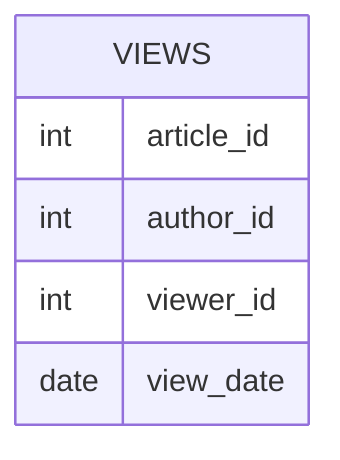

# leetcode : 1148. Article Views I
* [[leetcode : 1148. Article Views I]](https://leetcode.com/problems/article-views-i/description/)
<br>

---

### **다이어그램**


### **목표**
> 저자가 자신의 논문 본 로그있으면 추출

<br>

## 문제 풀이

### **MySQL**
```SQL
-- Solution 1
SELECT DISTINCT(AUTHOR_ID) AS ID
FROM VIEWS
WHERE AUTHOR_ID = VIEWER_ID
ORDER BY ID ASC
```

* Solution 1
  * DISTINCT로 중복값 제거하기
  
### **Pandas**
```python
# Solution 1
def article_views(views: pd.DataFrame) -> pd.DataFrame:
    droped = views.drop_duplicates(subset=['author_id','viewer_id'], keep='first')
    answer = droped[droped['author_id']==droped['viewer_id']][['author_id']]
    return answer.rename(columns={'author_id':'id'}).sort_values('id')
```

* Solution 1
  * 마찬가지로 rename, sort values, drop duplicates 써주기.
  
<br>

### **코멘트**
* 쉬운 문제
