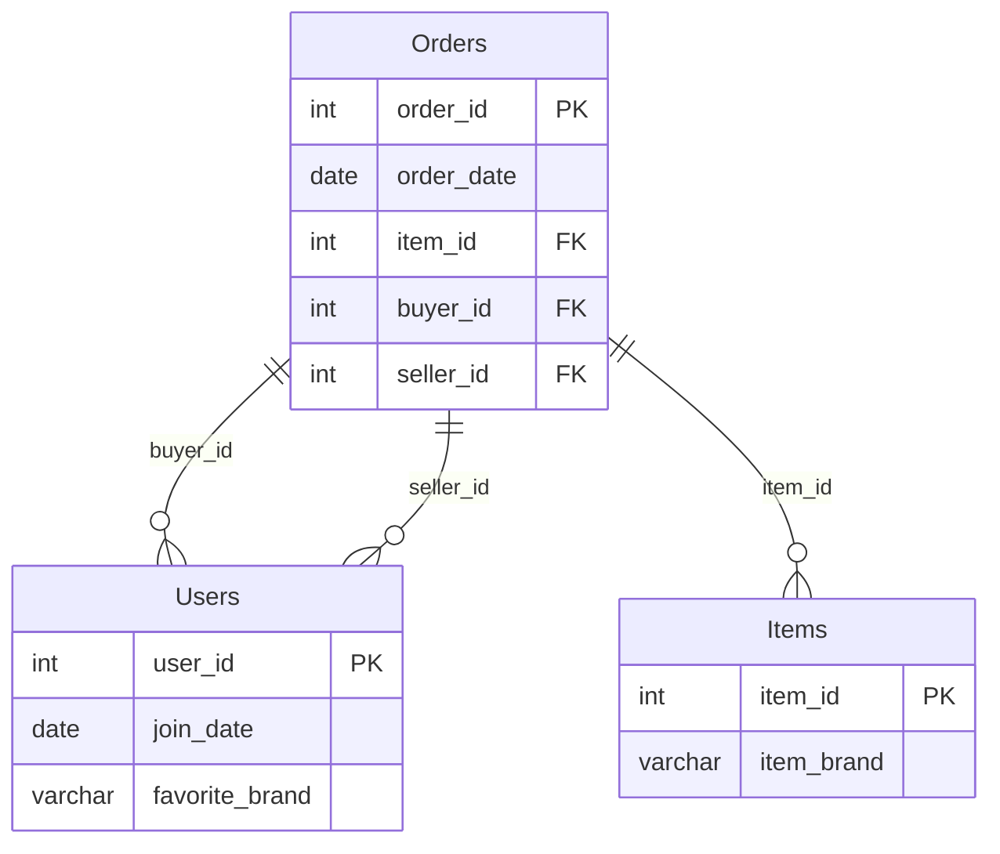

# leetcode : 1158. Market Analysis I
* [[leetcode : 1158. Market Analysis I]](https://leetcode.com/problems/market-analysis-i/description/)
<br>

---

### **다이어그램**


### **목표**
>

<br>

## 문제 풀이

### **MySQL**
```SQL
--  Solution 1
WITH ORDER_2019 AS (
    SELECT BUYER_ID, COUNT(*) AS ORDERS_IN_2019
    FROM ORDERS
    WHERE YEAR(ORDER_DATE) = 2019
    -- WHERE ORDER_DATE BETWEEN '2019-01-01' AND '2019-12-31'
    GROUP BY BUYER_ID
)

SELECT
    U.USER_ID AS BUYER_ID,
    U.JOIN_DATE,
    COALESCE(O.ORDERS_IN_2019, 0) AS ORDERS_IN_2019
FROM USERS U
LEFT JOIN ORDER_2019 O ON U.USER_ID = O.BUYER_ID
```

* Solution 1
  * year같은 경우 새로 변수를 파생하는거라 order_date에 인덱스가 부여되어있다면, 인덱스의 사용 효과가 없다고 한다.
  * 쿼리 작성 후, 최적화 시킬 때 위와 같은 사항 참고하기.

### **Pandas**
```python
# Solution 1
def market_analysis(users: pd.DataFrame, orders: pd.DataFrame, items: pd.DataFrame) -> pd.DataFrame:
    order2019 = orders[orders['order_date'].between('2019-01-01','2019-12-31')]
    order2019 = order2019.groupby('buyer_id').agg(orders_in_2019=('buyer_id','count')).reset_index()

    answer = pd.merge(users,order2019, left_on='user_id', right_on='buyer_id', how='left')
    answer = answer[['user_id','join_date','orders_in_2019']]
    answer['orders_in_2019'] = answer['orders_in_2019'].fillna(0)
    answer.rename(columns={'user_id':'buyer_id'}, inplace=True)
    return answer

# Solution 2
def market_analysis(users: pd.DataFrame, orders: pd.DataFrame, items: pd.DataFrame) -> pd.DataFrame:
    orders_2019 = orders[orders['order_date'].dt.year == 2019].groupby('buyer_id').agg(
        orders_in_2019 = ('buyer_id','size')
    ).reset_index()

    merged = pd.merge(users, orders_2019,
                        left_on='user_id', right_on='buyer_id', how='left')
    merged['orders_in_2019'] = merged['orders_in_2019'].fillna(0)
    return merged[['user_id','join_date','orders_in_2019']].rename(columns={'user_id':'buyer_id'})
```

* Solution 1
  * between + agg로 2019 구매자만 모아주기.
  * fillna를 통해서 null 채우기
  
* Solution 2
  * 비슷한 방법으로 풀이. between이나 dt.year나 큰 차이는 없는 듯
  
<br>

### **코멘트**
* .
