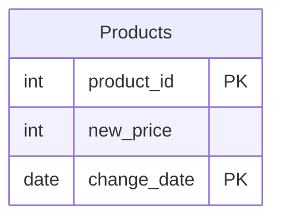

# leetcode : 1164. Product Price at a Given Date
* [[leetcode : 1164. Product Price at a Given Date]](https://leetcode.com/problems/product-price-at-a-given-date/description/)

<br>

---

### **다이어그램**


### **목표**
> `8월 16일의 PRICE 구하기`

<br>

## 문제 풀이

### **MySQL**
```SQL
WITH B16 AS (
    SELECT *
    FROM (
        SELECT PRODUCT_ID, NEW_PRICE AS PRICE_A,
            ROW_NUMBER() OVER (PARTITION BY PRODUCT_ID ORDER BY CHANGE_DATE DESC) AS IDX
        FROM PRODUCTS
        WHERE CHANGE_DATE <= '2019-08-16') AS B
    WHERE IDX = 1
),
A16 AS (
    SELECT *
    FROM (
        SELECT PRODUCT_ID, NEW_PRICE AS PRICE_B,
            ROW_NUMBER() OVER (PARTITION BY PRODUCT_ID ORDER BY CHANGE_DATE ASC) AS IDX
        FROM PRODUCTS
        WHERE CHANGE_DATE > '2019-08-16') AS A
    WHERE IDX = 1
),
TEMP AS (
    SELECT B.PRODUCT_ID, B.PRICE_A, A.PRICE_B
    FROM B16 B
    LEFT JOIN A16 A ON B.PRODUCT_ID = A.PRODUCT_ID

    UNION

    SELECT A.PRODUCT_ID, B.PRICE_A, A.PRICE_B
    FROM B16 B
    RIGHT JOIN A16 A ON B.PRODUCT_ID = A.PRODUCT_ID
    )

SELECT PRODUCT_ID,
        CASE
            WHEN PRICE_A IS NULL THEN 10
            ELSE PRICE_A
        END AS PRICE
FROM TEMP

-- Solution 2
WITH BEF AS (
    SELECT * FROM PRODUCTS WHERE CHANGE_DATE <= '2019-08-16'
),
AFT AS (
    SELECT * FROM PRODUCTS WHERE CHANGE_DATE > '2019-08-16'
),

BEF_PRICE AS (
SELECT PRODUCT_ID AS BEFORE_ID, NEW_PRICE AS BEFORE_PRICE, CHANGE_DATE AS MAX_DATE
FROM (
    SELECT PRODUCT_ID, NEW_PRICE, CHANGE_DATE,
           ROW_NUMBER() OVER (PARTITION BY PRODUCT_ID ORDER BY CHANGE_DATE DESC) AS RNK
    FROM BEF
) SUB
WHERE RNK = 1
),

AFT_PRICE AS (
    SELECT PRODUCT_ID AS AFTER_ID, NEW_PRICE AS AFTER_PRICE, CHANGE_DATE AS MIN_DATE
    FROM (
        SELECT PRODUCT_ID, NEW_PRICE, CHANGE_DATE,
            ROW_NUMBER() OVER (PARTITION BY PRODUCT_ID ORDER BY CHANGE_DATE) AS RNK
        FROM AFT
    ) SUB
    WHERE RNK = 1
),

JOINED AS (
    SELECT *
    FROM BEF_PRICE B
    LEFT JOIN AFT_PRICE A ON A.AFTER_ID = B.BEFORE_ID
    UNION
    SELECT *
    FROM BEF_PRICE B
    RIGHT JOIN AFT_PRICE A ON A.AFTER_ID = B.BEFORE_ID
)

SELECT
    IF(BEFORE_ID IS NULL, AFTER_ID, BEFORE_ID) AS PRODUCT_ID,
    CASE
        WHEN BEFORE_PRICE IS NULL THEN 10
        ELSE BEFORE_PRICE
    END AS PRICE
FROM JOINED
```

* Solution 1
  * 호흡이 길어서 조금 난도가 있었다.
  * 첫 번째로는 8.16일을 기점으로 테이블을 수평분할하기.
  * 각 분할 테이블에서 날짜를 기준으로 ROW_NUMBER를 부여하고, IDX = 1인 정보들을 가져온다.
  * BEFORE 16 테이블에서는 DESC로 해서 날짜가 가장 큰 것, AFTER 16 테이블에서는 ASC로 해서 날짜가 가장 작은 것
  * 이후 두 테이블을 OUTER JOIN해주기. MYSQL도 OUTER JOIN 지원 해라...
  * 8.16 이전 변경 데이터가 없으면 10, 그게 아니면 변경 이후 데이터를 가져오면 된다.
  
* Solution 2
  * 19.08.16기준 테이블 분할
  * rank로 before 테이블에서 가장 늦은 change, after 테이블에서 가장 빠른 change
  * 두 테이블 서로 합쳐주기. (outer join이 안돼서 left + right -> 중복 컬럼때문에 별칭 지정)
  * 마지막 변경 날짜가 19.08.16보다 같거나 작으면 before price, 아니면 10
    | BEFORE_ID | BEFORE_PRICE | MAX_DATE   | AFTER_ID | AFTER_PRICE | MIN_DATE   |
    | --------- | ------------ | ---------- | -------- | ----------- | ---------- |
    | 1         | 35           | 2019-08-16 | null     | null        | null       |
    | 2         | 50           | 2019-08-14 | 2        | 65          | 2019-08-17 |
    | null      | null         | null       | 3        | 20          | 2019-08-18 |
  

### **Pandas**
```python
# Solution 1
def price_at_given_date(products: pd.DataFrame) -> pd.DataFrame:

    cutoff_date = pd.to_datetime('2019-08-16')

    b16 = (products[products['change_date'] <= cutoff_date]
           .sort_values(by=['product_id', 'change_date'], ascending=[True, False])
           .drop_duplicates('product_id', keep='first')
           .rename(columns={'new_price': 'price_a'}))
    
    a16 = (products[products['change_date'] > cutoff_date]
           .sort_values(by=['product_id', 'change_date'], ascending=[True, True])
           .drop_duplicates('product_id', keep='first')
           .rename(columns={'new_price': 'price_b'}))
    
    temp = pd.merge(b16, a16, on='product_id', how='outer')
    temp['price'] = temp.apply(lambda row: 10 if pd.isna(row['price_a']) else (row['price_a'] if pd.isna(row['price_b']) else row['price_a']), axis=1)

    return temp[['product_id', 'price']]

# Solution 2
def price_at_given_date(products: pd.DataFrame) -> pd.DataFrame:

    cond = products['change_date']<='2019-08-16'
    before = products[cond]
    after = products[~cond]

    before_grouped = before.loc[before.groupby('product_id')['change_date'].idxmax()]
    after_grouped = after.loc[after.groupby('product_id')['change_date'].idxmin()]

    merged = pd.merge(before_grouped, after_grouped, on='product_id', how='outer')

    merged['price'] = np.where((merged['change_date_x'].isna()), 10, merged['new_price_x'])
    return merged[['product_id','price']]
```

* Solution 1
  * 같은 로직으로

* Solution 2:
  * 19.08.16 기준으로 날짜 분할하기.
  * idxmax, idxmin으로 각각 기간 내 가장 큰값, 작은 값 가져오기.
  * 테이블 조인해 주면 아래 테이블처럼 나온다.

    | product_id | new_price_x | change_date_x | new_price_y | change_date_y | price |
    | ---------- | ----------- | ------------- | ----------- | ------------- | ----- |
    | 1          | 35          | 2019-08-16    | null        | NaT           | 35    |
    | 2          | 50          | 2019-08-14    | 65          | 2019-08-17    | 50    |
    | 3          | null        | NaT           | 20          | 2019-08-18    | 10    |

  * price_x가 null이 아니면 price_x의 값을 가져온다.

<br>

### **코멘트**
* 요 근래 풀었던 리트코드 쿼리중에 제일 어려운듯
* 예전보단 쉽게 풀었지만... 쿼리 최적화가 필요하다.
* 다시 풀기
