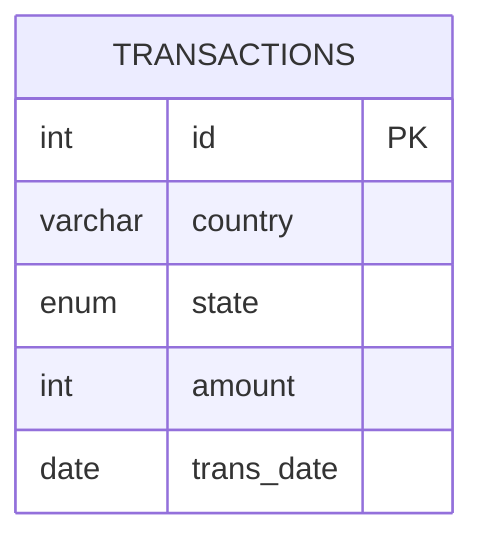

# leetcode : 1193. Monthly Transactions I
* [[leetcode : 1193. Monthly Transactions I]](https://leetcode.com/problems/monthly-transactions-i/description/)
<br>

---

### **다이어그램**


<br>

## 문제 풀이

### **MySQL**
```SQL
-- Solution 1
with tr_all as (
    select concat(year(trans_date),'-',lpad(month(trans_date),2,'0')) as month, country,
            count(*) as trans_count, sum(amount) as trans_total_amount
    from transactions
    group by concat(year(trans_date),'-',month(trans_date)), country
    ),

tr_approved as (
    select concat(year(trans_date),'-',lpad(month(trans_date),2,'0')) as month, country,
        count(*) as approved_count, sum(amount) as approved_total_amount
    from transactions
    where state = 'approved'
    group by concat(year(trans_date),'-',month(trans_date)), country
)
select A.month, A.country,
        A.trans_count, coalesce(B.approved_count,0) as approved_count,
        A.trans_total_amount, coalesce(B.approved_total_amount,0) as approved_total_amount
from tr_all as A
left join tr_approved as B on A.month = B.month and A.country = B.country

-- Solution 2
WITH TEMP AS (
    SELECT COUNTRY, STATE, AMOUNT, IF(STATE='approved', AMOUNT, 0) AS AMOUNT_COND, TRANS_DATE
    FROM TRANSACTIONS
)
SELECT
    DATE_FORMAT(TRANS_DATE, '%Y-%m') AS `month`,
    COUNTRY AS `country`,
    COUNT(*) AS `trans_count`,
    COUNT(IF(STATE='approved', 1, NULL)) AS `approved_count`,
    SUM(AMOUNT) AS `trans_total_amount`,
    SUM(AMOUNT_COND) AS `approved_total_amount`
FROM TEMP
GROUP BY DATE_FORMAT(TRANS_DATE, '%Y-%m'), COUNTRY;

-- Solution 3
SELECT
    DATE_FORMAT(trans_date, '%Y-%m') AS month,
    country,
    COUNT(*) AS trans_count,
    COUNT(IF(state = 'approved', 1, NULL)) AS approved_count,
    SUM(amount) AS trans_total_amount,
    SUM(IF(state = 'approved', amount, 0)) AS approved_total_amount
FROM
    Transactions
GROUP BY
    month,
    country

-- Solution 4
select  
    concat(year(trans_date),'-',lpad(month(trans_date),2,'0')) as month,
    country, 
    count(*) AS trans_count, sum(state = 'approved') as approved_count,
    sum(amount) AS trans_total_amount, sum((state = 'approved') * amount) as approved_total_amount
from transactions
group by concat(year(trans_date),'-',lpad(month(trans_date),2,'0')), country
```

* Solution 1
  * CTE로 일단 전체 값, approved 값을 이용해서 만든 테이블을 조인했다.
  * 처음에는 이렇게 풀었는데, test case 15에서 country에 null값이 포함된거를 처리하지 못해서 틀렸음.
  * full outer join 사용해서 left join table 두 번 합치려니 너무 아닌거같아서 솔루션 확인
  
* Solution 2
  * CTE로 승인유무에 따른 컬럼을 생성해준다.
  * 본 쿼리에서 COUNT IF, COUNT * 등을 활용해서 카운팅.

* Solution 3
  * 1등 풀이
  * COUNT IF 로 풀이, CTE없이 바로 더미컬럼 생성해서 계산했다.
  
* Solution 4
  * best solution을 보고 이런식으로 풀었다.
  * select에 서브쿼리 사용 못한다는 생각때문에, 저런식으로 조건문으로 T/F를 반환하는 식으로 풀이하는 방법은 생각못했다.
  * 어쨋든 T/F결과를 합하거나 값에 가격을 곱해서 구하는 식으로 풀이.
  

### **Pandas**
```python
# Solution 1
def monthly_transactions(transactions: pd.DataFrame) -> pd.DataFrame:
    transactions['country'] = transactions['country'].fillna('null')
    transactions['month'] = transactions['trans_date'].dt.strftime('%Y-%m')
    transactions['amount_state'] = np.where(transactions['state']=='approved',transactions['amount'],None)
    grouped = transactions.groupby(['month','country']).agg(
        trans_count = ('amount','size'),
        approved_count = ('amount_state','count'),
        trans_total_amount = ('amount','sum'),
        approved_total_amount  = ('amount_state','sum')
    ).reset_index()
    grouped['country'] = np.where(grouped['country']=='null',None,grouped['country'])
    return grouped

# Solution 2
def monthly_transactions(transactions: pd.DataFrame) -> pd.DataFrame:
    transactions['month'] = transactions['trans_date'].dt.strftime('%Y-%m')
    transactions['amount_state'] = np.where(transactions['state']=='approved',transactions['amount'],None)
    grouped = transactions.groupby(['month','country'], dropna=False).agg(
        trans_count = ('amount','size'),
        approved_count = ('amount_state','count'),
        trans_total_amount = ('amount','sum'),
        approved_total_amount  = ('amount_state','sum')
    ).reset_index()
    return grouped
```

* Solution 1
  * null값으로 group by 안돼서 예외처리를 fillna로 한 후, 마지막에 다시 null로 바꿔줬다.
  * 찾아보니까 dropna=False로 설정하면 더 간단하게 묶을 수 있다.

* Solution 2
  * dropna를 사용한 방법

  
<br>

### **코멘트**
* 집계 전에 컬럼을 만들어줘서 count, sum 등에서 부분만 포함되도록 조건을 걸어줄 수 있다.
