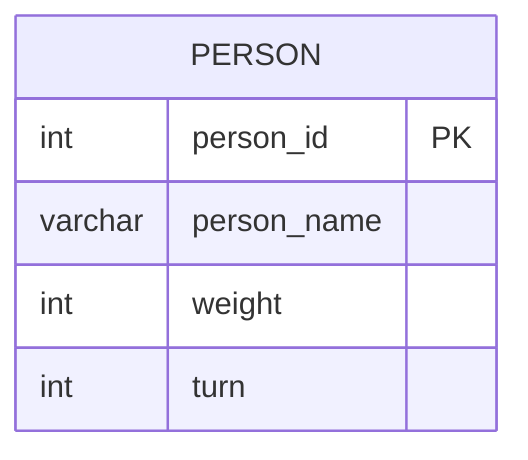

# leetcode : 1204. Last Person to Fit in the Bus
* [[leetcode : 1204. Last Person to Fit in the Bus]](https://leetcode.com/problems/last-person-to-fit-in-the-bus/description/)
<br>

---

### **다이어그램**


### **목표**
> 무게제한 막차 탄 사람 이름 구하기

<br>

## 문제 풀이

### **MySQL**
```SQL
WITH ORDERED AS (
    SELECT
        PERSON_NAME,
        SUM(WEIGHT) OVER (ORDER BY TURN) AS TOTAL_WEIGHT
    FROM QUEUE
)

SELECT PERSON_NAME
FROM ORDERED
WHERE TOTAL_WEIGHT <= 1000
ORDER BY TOTAL_WEIGHT DESC
LIMIT 1
```

* 윈도우 함수를 사용해서 문제풀이.
* weight에 누적합을 적용하고 대기 순서 turn으로 정렬을 걸어준다.
* 누적합이 1000이 넘지 않는 사람들의 쿼리를 역순을 정렬하고 하나 뽑아주기.
  
### **Pandas**
```python
# Solution 1
def last_passenger(queue: pd.DataFrame) -> pd.DataFrame:
    ordered = queue.sort_values('turn')
    ordered['total_weight'] = ordered['weight'].cumsum()
    answer = ordered[ordered['total_weight']<=1000]
    return answer[['person_name']].tail(1)

```

* Solution 1
  * SQL처럼 한 번에 정렬 + 누적합은 불가능해서 두 번 나눠서 풀이.
  * 정렬 이후에 cumsum으로 누적합을 구해준다.
  * iloc대신 tail 또는 head를 사용해서 앞에 있는 데이터프레임을 추출하기.
  
<br>

### **코멘트**
* .
