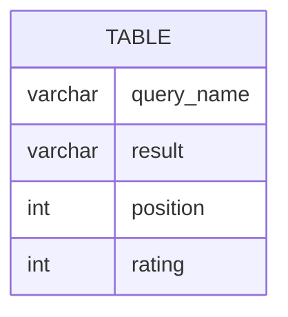

# leetcode : 1211. Queries Quality and Percentage
* [[leetcode : 1211. Queries Quality and Percentage]](https://leetcode.com/problems/queries-quality-and-percentage/description/)
<br>

---

### **다이어그램**


### **목표**
> 그룹의 퀄리티, poor 비율 찾기.

<br>

## 문제 풀이

### **MySQL**
```SQL
select query_name,
       round(avg(rating/position),2) as quality,
       round(100*sum(rating<3)/COUNT(*),2) AS poor_query_percentage
from queries
where query_name is not null
group by query_name

WITH TEMP AS (
    SELECT QUERY_NAME, RATING/POSITION AS QUALITY, IF(RATING<3,1,0) AS POOR
    FROM QUERIES
)

SELECT
    query_name,
    ROUND(AVG(QUALITY),2) AS quality,
    ROUND(100*SUM(POOR)/COUNT(*),2) AS poor_query_percentage
FROM TEMP
GROUP BY QUERY_NAME
```

* Solution 1
  * case whem 대신 그냥 조건식을 쓰면 불리언으로 반환돼서 깔끔하게 쓸 수 있다.
  * 문제에선 query name이 null인 경우는 원하지 않는다. (테케 12? 13?)
    * is not null로 제거해주기

* Solution 2
  * 가독성을 위해서 rating < 3처럼 그냥 조건 쓰는거보다, 조건절 썼다고 CASE WHEN이나 IF 넣는게 더 명확해보이긴 한다. T/F식이면 그냥 IF를 쓰자.

### **Pandas**
```python
# Solution 1
def queries_stats(queries: pd.DataFrame) -> pd.DataFrame:
    queries['r/q'] = queries['rating'] / queries['position'] + 1e-10
    queries['poor'] = queries['rating'] < 3
    answer = queries.groupby('query_name').agg(
        quality = ('r/q', lambda x: round(x.mean(),2)),
        poor_query_percentage = ('poor', lambda x: round(100*x.mean(),2))
    ).reset_index()
    
    return answer

# Solution 2
def queries_stats(queries: pd.DataFrame) -> pd.DataFrame:

    queries['quality'] = queries['rating']/queries['position'] + 1e-10
    queries['poor'] = np.where(queries['rating']<3,1,0)

    grouped = queries.groupby('query_name').agg(
        quality=('quality', lambda group: round(group.mean(),2)),
        poor_query_percentage=('poor', lambda group: round(100*group.sum()/len(group),2))
    ).reset_index()
    return grouped
```

* round에서 오차가 발생하네용 -> 1e-10 추가
  
* Solution 1
  * 비슷한 방식으로 풀이.
  * agg 내에서 지정되지 않은 함수를 사용할 때 lambda로 접근
  * lambda 내에서도 너무 복잡하게 나오지 않도록 미리 r/q, poor을 구했다.
  
* Solution 2
  * 예전이랑 비슷하게 풀었다.
  * groupby로 묶으면, lambda의 입력은 gruop의 집계 컬럼 시리즈 단위로 들어온다.
  
<br>

### **코멘트**
* 조건식에 case when 안넣고 그냥 하니까 더 깔끔하고 좋은듯.
* 다중 조건으로 많이 적는 경우에는 case when이 낫겠지만, T/F식으로 나뉘는 경우는 이렇게 푸는게 좋은 듯
* strictly less than이라고 적어다오...