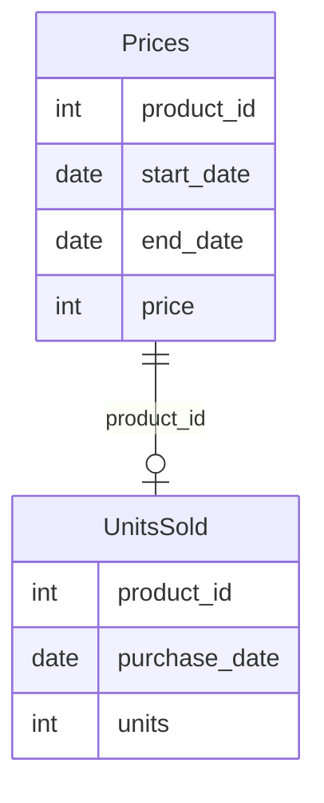

# leetcode : 1251. Average Selling Price
* [[leetcode : 1251. Average Selling Price]](https://leetcode.com/problems/average-selling-price/description/)
<br>

---

### **다이어그램**


### **목표**
> 날짜마다 상품의 가격이 달라진다.
> 
> units solds 테이블에서 구매 날짜를 보고 **매출/판매개수 = 평균 판매** 가격을 구한다.

<br>

## 문제 풀이

### **MySQL**
```SQL
-- Solution 1
select p.product_id, round(sum(p.price*u.units)/sum(u.units),2) as average_price
from prices as p
join unitssold as u on p.product_id = u.product_id
where u.purchase_date between p.start_date and p.end_date
group by p.product_id

union

select product_id,0
from prices
where product_id not in (select product_id from unitssold)

-- Solution 2
WITH TEMP AS (
    SELECT
        P.PRODUCT_ID,
        ROUND(SUM(PRICE*UNITS)/SUM(UNITS),2) AS AVERAGE_PRICE
    FROM PRICES P 
    JOIN UNITSSOLD U ON
        P.PRODUCT_ID = U.PRODUCT_ID AND
        U.PURCHASE_DATE BETWEEN P.START_DATE AND END_DATE
    GROUP BY P.PRODUCT_ID
)

SELECT P.PRODUCT_ID, COALESCE(T.AVERAGE_PRICE,0) AS AVERAGE_PRICE
FROM (SELECT DISTINCT PRODUCT_ID FROM PRICES) P
LEFT JOIN TEMP T ON T.PRODUCT_ID = P.PRODUCT_ID
```

* Solution 1
  * join을 통해서 풀이한다.
  * 사실 저렇게 join을 하면 각 그룹 개수를 ni라고 할 때, n0^2 + ... + ni^2 이렇게 나와서 시간적으로 유리한 코드는 아니다.
  * 어쨌든 join을 통해서 purchase date를 가져오고, group by를 통해서 각 상품별 평균 판매가격을 가져온다.
  * 판매이력이 없는 상품에 대해서도 결과값에 출력해줘야해서 union을 통해서 합쳐줬다.
    
* Solution 2
  * CTE에 GROUPBY로 먼저 집계를 해준다.
  * UNITSSOLD값이 비어있는 경우를 처리하기 위해 COALESCE를 사용


### **Pandas**
```python
# Soluion 1
def average_selling_price(prices: pd.DataFrame, units_sold: pd.DataFrame) -> pd.DataFrame:
    joined = pd.merge(prices,units_sold, how='left')
    joined['units'].fillna(0, inplace=True)

    selled = joined[
        (joined['units'] == 0) | 
        (joined['purchase_date'].between(joined['start_date'], joined['end_date']))
    ]
    selled['sales'] = selled['units']*selled['price']

    answer = selled.groupby('product_id').agg(
        sum_sales = ('sales','sum'),
        sum_cnt = ('units','sum')
    ).reset_index()

    answer['average_price'] = np.where(
        answer['sum_cnt'] != 0, (answer['sum_sales'] / answer['sum_cnt']).round(2), 0)
    return answer[['product_id', 'average_price']]

# Soluion 2
def average_selling_price(prices: pd.DataFrame, units_sold: pd.DataFrame) -> pd.DataFrame:
    joined = pd.merge(prices, units_sold, on='product_id')

    cond = joined['purchase_date'].between(joined['start_date'], joined['end_date'])
    joined['sales'] = joined['price']*joined['units']

    grouped = joined[cond].groupby('product_id').agg(
        unit_sum = ('units','sum'),
        sale_sum = ('sales','sum')
    ).reset_index()
    grouped['average_price'] = round(grouped['sale_sum']/grouped['unit_sum'],2)

    temp = pd.DataFrame({'product_id':prices['product_id'].unique()})
    answer = pd.merge(temp, grouped, on='product_id', how='left')
    answer['average_price'] = answer['average_price'].fillna(0)
    return answer[['product_id','average_price']]

# Solution 3
def average_selling_price(prices: pd.DataFrame, units_sold: pd.DataFrame) -> pd.DataFrame:
    df = pd.merge(prices, units_sold, on = "product_id", how = "left")
    df = df[(df.purchase_date >= df.start_date) & (df.purchase_date <= df.end_date) | df.purchase_date.isna()]
    df.fillna(0, inplace=True)
    df["price"] = df["price"] * df["units"]
    
    res = df.groupby("product_id").apply(lambda x: x["price"].sum() / x["units"].sum() if x["units"].sum() != 0 else 0).reset_index(name = "average_price")
    res["average_price"] = round(res["average_price"], 2)
    return res

# temp
grouped = joined[cond].groupby('product_id').apply(
    lambda group: round((group['price'] * group['units']).sum() / group['units'].sum(), 2)
).reset_index()
```

* Solution 1
  * 깔끔하게 짜기가 힘들다...
  * 위에 케이스처럼 판매 이력이 없는 데이터도 가져온다.
  * left join으로 가져오고 0으로 결측값 채우기.
  * group by에서 여러 집계연산 하기 힘드므로, 먼저 col에 따로 할당해주기.
  * np.where를 통해서 0/0꼴 연산 방지해서 계산결과 정답 컬럼에 할당하기.
  
* Solution 2
  * Groupby + apply
  * groupby + agg가 한 컬럼에만 적용되서 시리즈로 넘어왔다면, groupby + apply는 데이터 프레임 단위로 넘어와서 멀티 컬럼을 사용할 수 있다.

* Solution3 / temp
  * temp 요건 왜 안되는지 모르겠음....
  * groupby + apply로 멀티컬럼 접근해서 푼 사람 있는데 버전 차이로 reset index가 안되는건지 잘 모르겠다.
  * groupby에서 group 단위 데이터프레임으로 넘어가서 연산해주고, 결과로 나온 시리즈를 reset index 해결한다.
  * name을 넣어주든, dropna를 넣어주든 해결이 안되는....

<br>

### **코멘트**
* 다른사람 코드 짧아서 보면, 뒤에 주렁주렁 메서드 체인 걸어놨다.
* 나는 좀 풀어써서 길어지긴 했는데 easy 매겨질정돈가???
