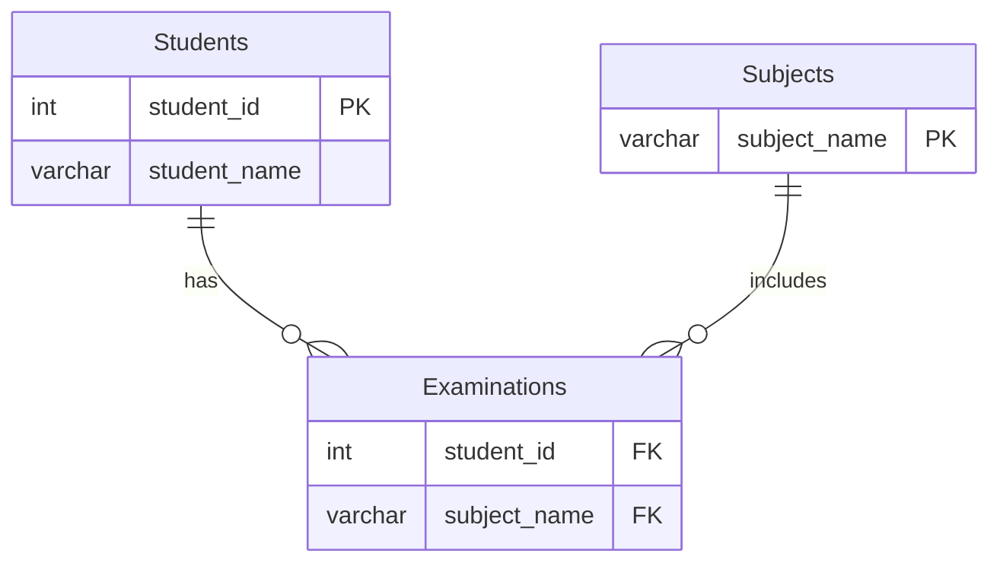

# leetcode : 1280. Students and Examinations
* [[leetcode : 1280. Students and Examinations]](https://leetcode.com/problems/students-and-examinations/description/)
<br>

---

### **다이어그램**


### **목표**
> 각 학생의 과목 수강 횟수 (과목 리스트에 있는 과목 전부)


<br>

## 문제 풀이

### **MySQL**
```SQL
-- Solution 1
with temp as (
    select s.student_id, s.student_name, sub.subject_name
    from students s
    cross join subjects sub
),
grouped as (
    select student_id, subject_name, count(*) as attended_exams
    from examinations
    group by student_id, subject_name
)
select t.student_id, t.student_name, t.subject_name, coalesce(g.attended_exams, 0) as attended_exams
from temp t
left join grouped g on t.student_id = g.student_id and t.subject_name = g.subject_name
order by t.student_id, t.subject_name

-- Solution 2
WITH JOINED AS (
    SELECT *
    FROM STUDENTS AS ST
    CROSS JOIN SUBJECTS AS SUB
)

SELECT J.*, COUNT(E.STUDENT_ID) AS ATTENDED_EXAMS
FROM JOINED J
LEFT JOIN EXAMINATIONS E
    ON E.STUDENT_ID = J.STUDENT_ID
    AND E.SUBJECT_NAME = J.SUBJECT_NAME
GROUP BY J.STUDENT_ID, J.SUBJECT_NAME
ORDER BY J.STUDENT_ID, J.SUBJECT_NAME
```

* Solution 1
  * cross join을 한 테이블과 시험내역을 group by한 테이블을 left join한다.
  * 학생 테이블은 모든 학생 정보를 담고 있고, 시험 테이블에서는 일부 학생만 있는데 결과 쿼리에서는 전체 학생을 원해서 cross join 이후, left join을 한다.
  
* Solution 2
  * 
  
### **Pandas**
```python
# SOlution 1
def students_and_examinations(students: pd.DataFrame, subjects: pd.DataFrame, examinations: pd.DataFrame) -> pd.DataFrame:
    
    temp = pd.MultiIndex.from_product([students['student_id'], subjects['subject_name']], names=['student_id', 'subject_name']).to_frame(index=False)
    temp = temp.merge(students, on='student_id')
    
    grouped = examinations.groupby(['student_id', 'subject_name']).size().reset_index(name='attended_exams')
    
    answer = temp.merge(grouped, on=['student_id', 'subject_name'], how='left')
    answer['attended_exams'].fillna(0, inplace = True)
    answer.sort_values(by=['student_id', 'subject_name'], inplace=True)
    return answer[['student_id','student_name','subject_name','attended_exams']]

# SOlution 2
def students_and_examinations(students: pd.DataFrame, subjects: pd.DataFrame, examinations: pd.DataFrame) -> pd.DataFrame:
    joined = pd.merge(students, subjects, how='cross')
    grouped = examinations.groupby(['student_id','subject_name']).agg(
        attended_exams = ('subject_name','size')
    ).reset_index()

    answer = pd.merge(joined, grouped, on=['student_id','subject_name'], how='left')
    answer['attended_exams'] = answer['attended_exams'].fillna(0)
    return answer.sort_values(by=['student_id','subject_name'])

```

* Solution 1
  * chatgpt한테 물어보니까 multiindex 써야한다는데, 그냥 how = 'cross'가 있더라...
* Solution 2
  * cross join + group + merge
  
<br>

### **코멘트**
* cross join 했는데도 테이블 사이즈가 크지 않은거같아서 SQL기준 상위 15퍼정도 속도 나왔음.
* 애초에 테이블을 보면 정규화가 잘 된 케이스라서 자연스럽게 구하는 형태를 보고 cross join 방향으로 갈 수 있다.