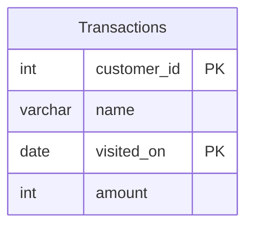

# leetcode : 1321. Restaurant Growth
* [[leetcode : 1321. Restaurant Growth]](https://leetcode.com/problems/restaurant-growth/description/)
<br>

---

### **다이어그램**


### **목표**
> `이동평균, 이동합(?)을 구하는 문제`
  
<br>

## 문제 풀이

### **MySQL**
```SQL
-- Solution 1
with sales_day as (
    select visited_on, sum(amount) as amount
    from customer
    group by visited_on
    order by visited_on
),
moving_avg as (
    select visited_on,
        round(sum(amount) over (order by visited_on rows between 6 preceding and current row), 2) as amount,
        round(avg(amount) over (order by visited_on rows between 6 preceding and current row), 2) as average_amount
    from sales_day
)

select *
from moving_avg
where visited_on >= (select min(visited_on) + interval 6 day from moving_avg)
order by visited_on;

-- Solution 2
WITH TEMP AS (
    SELECT
        VISITED_ON,
        SUM(AMOUNT) OVER (ORDER BY VISITED_ON RANGE BETWEEN INTERVAL 6 DAY PRECEDING AND CURRENT ROW) AS AMOUNT,
        ROUND(AVG(AMOUNT) OVER (ORDER BY VISITED_ON RANGE BETWEEN INTERVAL 6 DAY PRECEDING AND CURRENT ROW),2) AS AVERAGE_AMOUNT,
        ROW_NUMBER() OVER (ORDER BY VISITED_ON) AS RN
    FROM (SELECT VISITED_ON, SUM(AMOUNT) AS AMOUNT FROM CUSTOMER GROUP BY VISITED_ON) SUB
)

SELECT VISITED_ON, AMOUNT, AVERAGE_AMOUNT
FROM TEMP
WHERE RN >= 7
```

* Solution 1
  * 일단 주어진 테이블이 정렬됐다는 보장이 없으므로, 날짜로 group by + order by를 진행한다.
  * 두 번째 CTE에서 이동평균, 이동합을 구해준다.
  * 세 번째로는 첫 날짜로 부터 6일이 흐른 시점부터 WINDOW를 적용 가능하므로 날짜 조건을 WHERE로 걸어준다.
  
* Solution 2
  * 이동평균 구간합 구해주면서 rownum으로 번호까지 매기기
  
### **Pandas**
```python
# Solution 1
def restaurant_growth(customer: pd.DataFrame) -> pd.DataFrame:
    grouped = customer.groupby('visited_on').agg(
        sales_day = ('amount','sum')
    ).reset_index()
    grouped['amount'] = grouped['sales_day'].rolling(window=7).sum()
    grouped['average_amount'] = grouped['sales_day'].rolling(window=7).mean().round(2)
    return grouped[~grouped['average_amount'].isnull()][['visited_on','amount','average_amount']]

# Solution 2
def restaurant_growth(customer: pd.DataFrame) -> pd.DataFrame:

    grouped = customer.groupby('visited_on').sum().reset_index()
    grouped = grouped[['visited_on','amount']].sort_values('visited_on')
    grouped['cumsum'] = grouped['amount'].rolling(window=7).sum().round(2)
    grouped['average_amount'] = grouped['amount'].rolling(window=7).mean().round(2)
    answer = grouped[['visited_on','cumsum','average_amount']]
    answer = answer.rename(columns={'cumsum':'amount'})
    return answer[~(answer['average_amount'].isna())]
```

* Solution 1
  * rolling으로 window size 고정 시키는 메서드가 존재한다
  * groupby로 날짜 별 매출을 묶고, rolling + 집계함수를 통해서 문제풀이

* Solution 2
  * rolling + 집계.
  * fillna, np.nan 등 통일성 맞추어서 isna쓰기.
  
<br>

### **코멘트**
* 윈도우 함수 기본