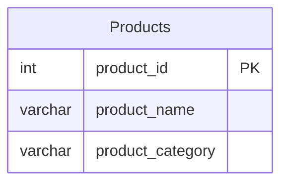

# leetcode : 1327. List the Products Ordered in a Period
* [[leetcode : 1327. List the Products Ordered in a Period]](https://leetcode.com/problems/list-the-products-ordered-in-a-period/description/)
<br>

---

### **다이어그램**


* `2월에 판매된 제품들 중, 매출이 100 넘는 제품의 이름과 매출 출력하기`

<br>

## 문제 풀이

### **MySQL**
```SQL
-- Solution 1
with feb_sales as (
    select *, sum(unit) as amount
    from orders
    where order_date between '2020-02-01' and '2020-02-29'
    group by product_id
    having sum(unit) >= 100
)

select p.product_name, f.amount as unit
from feb_sales f
join products p on f.product_id = p.product_id

-- Solution 2
WITH FEB AS (
    SELECT PRODUCT_ID, SUM(UNIT) AS UNIT
    FROM ORDERS
    WHERE ORDER_DATE BETWEEN '2020-02-01' AND '2020-02-29'
    GROUP BY PRODUCT_ID
    HAVING SUM(UNIT) >= 100
)

SELECT P.PRODUCT_NAME, F.UNIT
FROM FEB F
JOIN PRODUCTS P ON P.PRODUCT_ID = F.PRODUCT_ID
```

* Solution 1,2
  * CTE에 GROUP BY + HAVING을 통해서 2월의 orders table에서 제품별 합을 구한다.
  * join 통해서 제품이름 출력하기.
  * 실행 속도는 inner join이 훨씬 빠르다.

### **Pandas**
```python
# Solution 1
def list_products(products: pd.DataFrame, orders: pd.DataFrame) -> pd.DataFrame:
    orders['feb20'] = orders['order_date'].dt.strftime('%Y-%m') == '2020-02'
    grouped = orders[orders['feb20']==True].groupby('product_id').agg(
        unit = ('unit','sum')
    ).reset_index()

    answer = pd.merge(grouped[grouped['unit']>=100],products)
    return answer[['product_name','unit']]

# Solution 2
def list_products(products: pd.DataFrame, orders: pd.DataFrame) -> pd.DataFrame:
    grouped = (orders[orders['order_date'].between('2020-02-01','2020-02-29')]
    .groupby('product_id')
    .agg(
        unit = ('unit','sum')
    )).reset_index()
    answer = pd.merge(products, grouped[grouped['unit']>=100])
    return answer[['product_name','unit']]
=
```

* Solution 1,2
  * 날짜필터 걸어주고, group by + sum으로 그룹
  * grouped에서 100이 넘는 것 들 중에서 products와 join.
  * 날짜 필터를 걸어주는 방식에 strftime, between이 있는데 MySQL에서는 strftime처럼 다른 변수를 생성하면 인덱스가 걸려있는 경우 성능 차이가 굉장히 난다.
  * 대용량 데이터가 아니라서 쿼리 동작속도에 큰 차이는 없지만 betweet처럼 추가적인 연산이 필요 없는 방식으로 작성하기. 

<br>

### **코멘트**
* .
