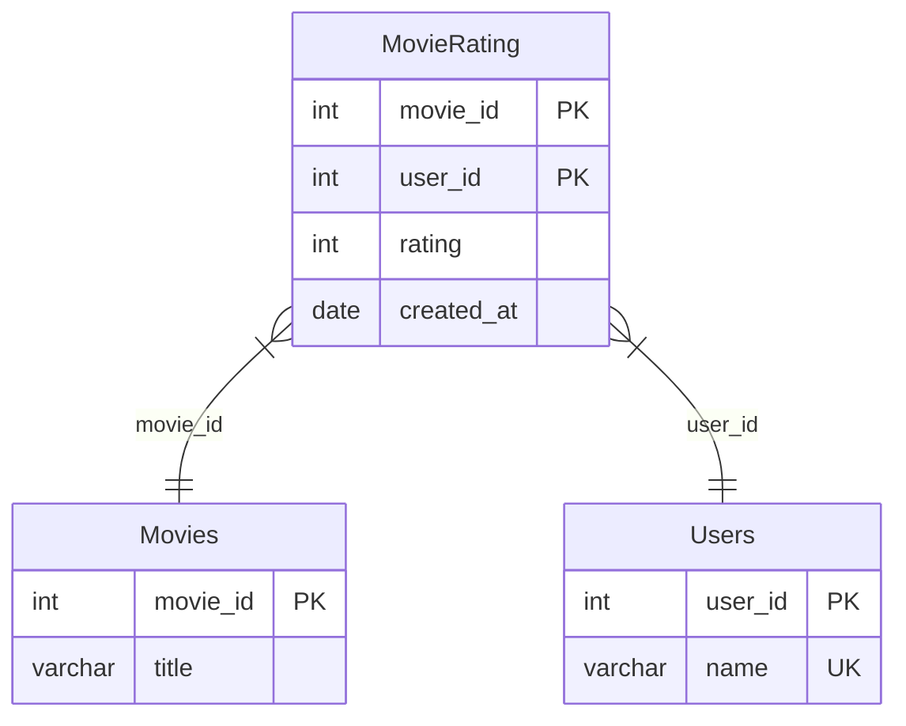

# 리트코드 : 1341. Movie Rating
* https://leetcode.com/problems/movie-rating/description/

---

### **다이어그램**



### **목표**
> 평점 가장 많이 매긴 사람 + 평점 가장 높은 영화 두 가지를 구하면 된다.

<br>

## 문제 풀이

### **MySQL**
```SQL
with feb as (
    select *, avg(rating) as score
    from movierating
    where left(created_at,7) = '2020-02'
    group by movie_id
),
rated as (
    select *, count(*) as cnt
    from movierating
    group by user_id
),

name as (
    select name as results
    from users u
    join rated r on r.user_id = u.user_id
    where cnt = (select max(cnt) from rated)
    order by name
    limit 1
),

movie_name as (
select m.title as results
from feb f
join movies m on f.movie_id = m.movie_id
where score = (select max(score) from feb)
order by title
limit 1
)

select * from name
union all
select * from movie_name
```

* Solution 1
  * CTE에 결과를 마구마구 저장하기.
  * 평점같은 경우는 movie id로, 평점 매긴 사람은 user_id로 group by
  * 각 테이블에서 서브쿼리로 최대 평가 수, 최대 평점을 가진 것을 가져온다.
  * 컬럼명을 results로 맞춰주고 union all
    * test case 18에 이름/영화이름이 동일한 경우가 있어서 중복허용 안하면 사라진다.
  
* Solution 2
```SQL
WITH RATED_COUNT AS (
    SELECT
        U.NAME AS results,
        ROW_NUMBER() OVER (ORDER BY COUNT(*) DESC, U.NAME) AS RN
    FROM MOVIERATING MR
    JOIN USERS U ON U.USER_ID = MR.USER_ID
    GROUP BY MR.USER_ID, U.NAME
),

RATED_SCORE AS (
    SELECT M.TITLE AS results
    FROM MOVIERATING MR
    JOIN MOVIES M ON MR.MOVIE_ID = M.MOVIE_ID
    WHERE MR.CREATED_AT BETWEEN '2020-02-01' AND '2020-02-29'
    GROUP BY MR.MOVIE_ID
    ORDER BY AVG(RATING) DESC, M.TITLE
)

SELECT results
FROM RATED_COUNT
WHERE RN = 1
UNION ALL
SELECT results
FROM RATED_SCORE
LIMIT 2
```

* Solution 2
  * ROW NUMBER로 리뷰개수 1등을 가져온다.
  * SCORE 집계 함수 테이블과 UNION을 해주고, LIMIT 2 해주면 이름/영화 1등이 나온다.


### **Pandas**
```python
def movie_rating(movies: pd.DataFrame, users: pd.DataFrame, movie_rating: pd.DataFrame) -> pd.DataFrame:

    user_grouped = movie_rating.groupby('user_id').agg(
        cnt = ('user_id','count')
    ).reset_index()

    avg_score = movie_rating[movie_rating['created_at'].between('2020-02-01','2020-02-29')].groupby('movie_id').agg(
        score = ('rating','mean')
    ).reset_index()
    
    max_name = pd.merge(user_grouped, users)
    max_movie = pd.merge(avg_score, movies)
    max_name.sort_values(['cnt','name'], ascending=[0,1], inplace=True)
    max_movie.sort_values(['score','title'], ascending=[0,1], inplace=True)

    answer = pd.DataFrame({'results': [max_name['name'].values[0], max_movie['title'].values[0]]})
    return answer
```

* Solution 1
  * 마찬가지로 groupby + agg로 집계하기.
  * merge를 통해 join해주고
  * sort values에서 다중 조건으로 정렬하기
  

```python
def movie_rating(movies: pd.DataFrame, users: pd.DataFrame, movie_rating: pd.DataFrame) -> pd.DataFrame:
    rated_count = movie_rating.groupby('user_id').agg(
        cnt = ('user_id','size')
    ).reset_index()

    cond_feb = movie_rating['created_at'].between('2020-02-01','2020-02-29')
    rated_score = movie_rating[cond_feb].groupby('movie_id').agg(
        avg_score = ('rating','mean')
    ).reset_index()

    top_user = pd.merge(rated_count, users).sort_values(by=['cnt','name'], ascending=[False, True]).head(1)
    top_movie = pd.merge(rated_score, movies).sort_values(by=['avg_score','title'], ascending=[False, True]).head(1)

    return pd.DataFrame({'results':[top_user['name'].values[0], top_movie['title'].values[0] ]})
```

* Solution 2
  * 비슷한 방식으로 풀이.
  * head로 맨 위 결과만 가져온다.
  * vaelus에서 [0]을 안붙이면 np array라서 답은 같아보여도 오답으로 나온다.

<br>

### **코멘트**
* .
