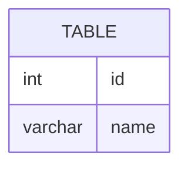

# leetcode : 1378. Replace Employee ID With The Unique Identifier

* [[leetcode : 1378. Replace Employee ID With The Unique Identifier]](https://leetcode.com/problems/replace-employee-id-with-the-unique-identifier/description/)
<br>

### **다이어그램**


### **목표**
* `각 유저의 id가 unique인지 판별하고 unique하면 id를, 아니면 null을 반환하는 문제`

<br>

## 문제 풀이

### **MySQL**
```SQL
select u.unique_id, e.name
from employees e
left join employeeUNI u on e.id = u.id;
```

* 기본 left join 문제이다.
* 행 수가 더 많은 emp테이블을 기준으로 emp uni와 left join을 해주면 된다.
  
### **Pandas**
```python
def replace_employee_id(employees: pd.DataFrame, employee_uni: pd.DataFrame) -> pd.DataFrame:
    grouped = pd.merge(employees,employee_uni, how='left')
    return grouped[['unique_id','name']]
```

* pd.merge에 left join으로 조인
* 공통 컬럼이 하나인 경우에는 굳이 on에 지정을 안해도 된다.
  * 웬만하면 가독성을 위해서 지정해주기.
  * 속도 면에서도 지정하는게 조금더 빠르다고 한다.
  
<br>

### **코멘트**
* .
