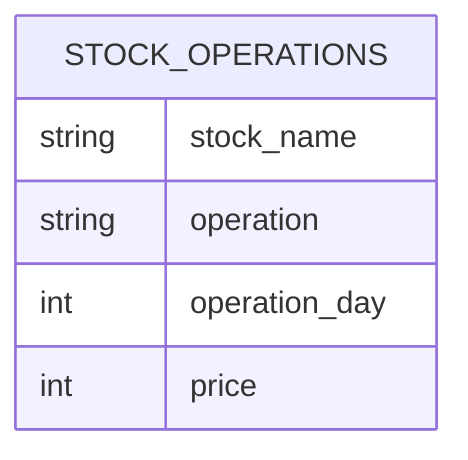

# leetcode : 1393. Capital Gain/Loss

* [[leetcode : 1393. Capital Gain/Loss]](https://leetcode.com/problems/capital-gainloss/description/)
<br>

---

### **다이어그램**


* `각 주식별 총 gain loss 구하기`

<br>

## 문제 풀이

### **MySQL 1**
```SQL
select stock_name, sum(if(operation='buy', -price, price)) as capital_gain_loss
from stocks
group by stock_name
```

* 처음에는 group by로 주식별 buy sell 나누려고 했다.
* 이러면 두 테이블 join시 null값을 처리해야해서 한 번에 sum if로 처리
* 1등 코드랑 거의 똑같이 짰음~


### **MySQL 2**
```SQL
WITH TEMP AS (
    SELECT STOCK_NAME, IF(OPERATION='Buy',-PRICE,PRICE) AS FLOW
    FROM STOCKS
)

SELECT STOCK_NAME, SUM(FLOW) AS CAPITAL_GAIN_LOSS
FROM TEMP
GROUP BY STOCK_NAME
```

* CTE로 주식 이름이랑 현금 흐름만 IF로 +- 처리
* GROUP BY + SUM으로 문제풀이.

  
### **Pandas**
```python
def capital_gainloss(stocks: pd.DataFrame) -> pd.DataFrame:
    stocks['capital_gain_loss']=np.where(stocks['operation']=='Buy', -stocks['price'],stocks['price'])
    return stocks.groupby('stock_name')['capital_gain_loss'].sum().reset_index()
```

* 같은 방식으로 짠 코드.
* sum if 대신 np.where로 조건걸어주기.
* 예전이랑 같은 방식으로 문제 풀이.
* 흐름이 긴 코드의 경우에는 agg + sum으로 풀지만, 간단한 경우에는 바로 groupby + sum을 사용
  
<br>

### **코멘트**
* 개인 레퍼런스 만들면서 보는중인데, 생각나는 부분은 확실히 빨라졌다.
