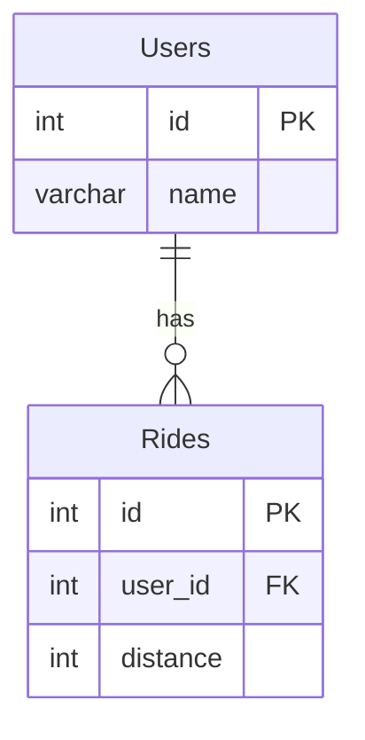

# leetcode : 1407. Top Travellers
* [[leetcode : 1407. Top Travellers]](https://leetcode.com/problems/top-travellers/description/)

<br>

---

### **다이어그램**


* `유저별 라이딩 정보 합계 후 정렬기준 맞춰서 반환하기`

<br>

## 문제 풀이

### **MySQL 1**
```SQL
select users.name, coalesce(temp.dist,0) as travelled_distance
from users
left join 
    (select *, sum(distance) as dist 
    from rides
    group by user_id) as temp
on temp.user_id = users.id
order by temp.dist desc, users.name
```

* cte나 서브쿼리 쓰는게 조금 느리긴 한데 가독성 면이나 생각의 순서가 보여서 좀 더 편하다.
* left join에서 발생하는 null값은 coalesce로 처리

### **MySQL 2**
```SQL
WITH GROUPED AS (
    SELECT USER_ID, SUM(`DISTANCE`) AS TRAVELLED_DISTANCE
    FROM RIDES
    GROUP BY USER_ID
)

SELECT U.NAME, COALESCE(G.TRAVELLED_DISTANCE,0) AS TRAVELLED_DISTANCE
FROM USERS U
LEFT JOIN GROUPED G ON G.USER_ID = U.ID
ORDER BY TRAVELLED_DISTANCE DESC, U.NAME ASC
```

* CTE를 사용해서 유저 별 합계를 먼저 구한 후
* LEFT JOIN하며 발생하는 NULL값을 COALESCE로 처리.
* IFNULL도 되긴 하는데 표준 SQL로 쓰는게 좋은거같아서 COALESCE 사용
  
### **Pandas 1**
```python
def top_travellers(users: pd.DataFrame, rides: pd.DataFrame) -> pd.DataFrame:
    grouped = rides.groupby('user_id').agg(
        travelled_distance = ('distance','sum')
    ).reset_index()
    joined = pd.merge(grouped, users, how='right', left_on='user_id', right_on='id')
    joined['travelled_distance'].fillna(0,inplace=True)
    joined.sort_values(['travelled_distance','name'], ascending=[0,1], inplace=True)
    return joined[['name','travelled_distance']]
```

### **Pandas 2**
```python
def top_travellers(users: pd.DataFrame, rides: pd.DataFrame) -> pd.DataFrame:
    grouped = rides.groupby('user_id').agg(
        travelled_distance = ('distance','sum')
        ).reset_index()
    joined = pd.merge(grouped, users, left_on='user_id', right_on='id', how='right')
    joined['travelled_distance'] = joined['travelled_distance'].fillna(0)
    return joined[['name','travelled_distance']].sort_values(by=['travelled_distance','name'], ascending=[False,True])
```

* agg로 컬럼명 바꾸면서 유저 별 합계 구한다.
* 컬럼명이 다르니 left right on을 통해서 join
* null값 처리는 fillna 후 정렬기준 맞춰서 출력

<br>

### **코멘트**
* .
