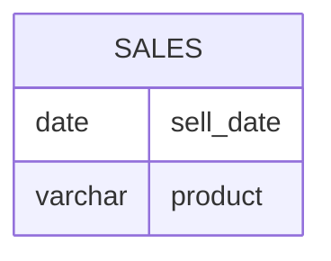

# leetcode : 1484. Group Sold Products By The Date

* [[leetcode : 1484. Group Sold Products By The Date]](https://leetcode.com/problems/group-sold-products-by-the-date/description/)
<br>

---

### **다이어그램**


* `각 날짜에 팔린 물건들 오름차순으로 정리해서 문자열 연결`

<br>

## 문제 풀이

### **MySQL**
```SQL
SELECT SELL_DATE,
    COUNT(DISTINCT(PRODUCT)) AS NUM_SOLD,
    GROUP_CONCAT(DISTINCT PRODUCT ORDER BY PRODUCT SEPARATOR ',') AS PRODUCTS
FROM ACTIVITIES
GROUP BY SELL_DATE;
```

* GROUP_CONCAT이란 함수가 있어서 사용해주면 된다.
* GROUP_CONCAT(합칠 컬럼 정렬기준 SEPARATOR 구분자)
  
### **Pandas 1**
```python
import pandas as pd

def categorize_products(activities: pd.DataFrame) -> pd.DataFrame:
    grouped = activities.groupby('sell_date').agg(
        num_sold=('product', 'nunique'),
        products=('product', lambda x: ','.join(sorted(x.unique())))
    ).reset_index()
    return grouped
```

* products=('product', lambda x: ','.join(sorted(x.unique())))
* 이 부분처럼 product 객체 모아놓고, lambda 함수 적용시켜서 반환하기.
* 파이썬으로는 어려울게 없다.
* groupby + lambda에서 sell_date가 같은 데이터프레임이 전해지고, 이 데이터프레임의 product에 접근한다.
* x가 grouped[grouped['sell_date']==어떤 날짜]['product']이다.
* 반환된 시리즈의 x.unique로 상품명에 접근 후 join으로 합쳐주기

### **Pandas 2**
```python
import pandas as pd
from collections import defaultdict as dd

def categorize_products(activities: pd.DataFrame) -> pd.DataFrame:
    temp = dd(set)
    for _, row in activities.iterrows():
        temp[row['sell_date']].add(row['product'])
    
    answer = pd.DataFrame({
        'sell_date': list(temp.keys()),
        'num_sold': [len(products) for products in temp.values()],
        'products': [','.join(sorted(products)) for products in temp.values()]
    })
    
    answer = answer.sort_values('sell_date').reset_index(drop=True)
    return answer
```
* for문으로 접근해서 풀기
  
<br>

### **코멘트**
* .