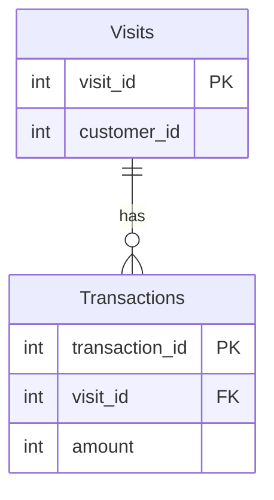

# leetcode : 1581. Customer Who Visited but Did Not Make Any Transactions

* [[leetcode : 1581. Customer Who Visited but Did Not Make Any Transactions]](https://leetcode.com/problems/customer-who-visited-but-did-not-make-any-transactions/description/)
<br>

---

### **다이어그램**


* `방문 후, 거래가 없는 고객들의 id와 그 수`

<br>

## 문제 풀이

### **MySQL 1**
```SQL
WITH no_trans as (
    SELECT v.customer_id, t.transaction_id 
    FROM visits v
    LEFT JOIN transactions t ON v.visit_id = t.visit_id
)

SELECT customer_id, count(*) as count_no_trans
FROM no_trans
WHERE transaction_id is null
GROUP BY customer_id
```

* LEFT JOIN을 통해서, 방문은 했지만 거래 데이터가 없는 사람들까지 표현해준다.
* 이후 GROUP BY COUNT를 통해서 개수 카운팅해주기.

### **MySQL 2**
```SQL
SELECT V.CUSTOMER_ID, COUNT(*) AS COUNT_NO_TRANS
FROM VISITS V
LEFT JOIN TRANSACTIONS T ON V.VISIT_ID = T.VISIT_ID
WHERE T.TRANSACTION_ID IS NULL
GROUP BY V.CUSTOMER_ID
```

* LEFT JOIN을 통해 NULL 데이터만 취합한다 (방문 후 거래하지 않은 사람)
* IS NULL + GROUP BY + COUNT로 카운팅해주기
  
### **Pandas 1**
```python
import pandas as pd

def find_customers(visits: pd.DataFrame, transactions: pd.DataFrame) -> pd.DataFrame:
    joined = pd.merge(visits, transactions, on='visit_id', how='left')

    answer = joined[joined['transaction_id'].isnull()].groupby('customer_id').agg(
        count_no_trans = ('transaction_id','size')
    ).reset_index()
    return answer
```

* 파이썬에서는 count, size를 구분하고 있으니 NULL을 카운팅해주는 size를 사용한다.
  
### **Pandas 2** 
```
def find_customers(visits: pd.DataFrame, transactions: pd.DataFrame) -> pd.DataFrame:
    merged = pd.merge(visits, transactions, on='visit_id', how='left')
    cond = merged['transaction_id'].isna()

    answer = merged[cond].groupby('customer_id').size().reset_index(name='count_no_trans')
    return answer[['customer_id','count_no_trans']]
```

* 커스텀 함수가 없거나, 간단한 집계로 넘어가는 경우에는 바로 groupby+집계함수 사용해주기.
* size의 경우는 바로 이름 할당이 가능하다.

<br>

### **코멘트**
* 쉽다