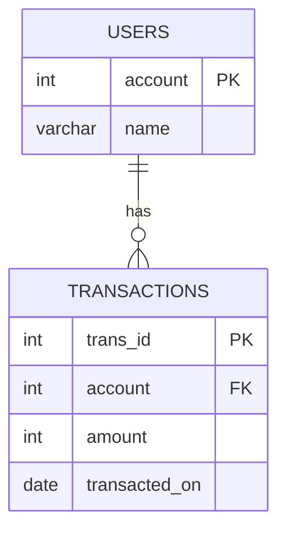

# leetcode : 1587. Bank Account Summary II

* [[leetcode : 1587. Bank Account Summary II]](https://leetcode.com/problems/bank-account-summary-ii/description/)
<br>

---

### **다이어그램**


* `통장정리 후, 정리한 기록이 10000보다 큰 사람과 금액 출력`

<br>

## 문제 풀이

### **MySQL 1**
```SQL
SELECT u.name, SUM(amount) as balance
FROM users u
JOIN transactions t on u.account = t.account
GROUP BY t.account
HAVING SUM(amount) > 10000
```

### **MySQL 2**
```SQL
SELECT U.NAME, SUM(AMOUNT) AS BALANCE
FROM USERS U
JOIN TRANSACTIONS T ON U.ACCOUNT = T.ACCOUNT
GROUP BY U.ACCOUNT
HAVING SUM(AMOUNT) > 10000
```

* account로 JOIN 후, GROUP BY + HAVING으로 출력해주기.
* 개인적으로는 HAVING이나 ORDER BY에는 ALIAS를 쓴 상태로 넣는게 더 좋아보인다.
  
### **Pandas 1**
```python
def account_summary(users: pd.DataFrame, transactions: pd.DataFrame) -> pd.DataFrame:
    joined = pd.merge(users, transactions, on='account')
    grouped = joined.groupby(['account','name']).agg(
        balance = ('amount','sum')
    ).reset_index()
    return grouped[grouped['balance']>10000][['name','balance']]
```

### **Pandas 2**
```python
def account_summary(users: pd.DataFrame, transactions: pd.DataFrame) -> pd.DataFrame:
    joined = pd.merge(users, transactions)
    grouped = joined.groupby(['account','name']).agg(
        balance = ('amount','sum')
    ).reset_index()
    return grouped[grouped['balance']>10000][['name','balance']]
```

* 마찬가지로 merge 이후, account, named으로 group by (account로만 묶으면 name 없어져서)
* 이후에 조건 걸어줘서 출력
* 다시 풀었는데 merge에 on 빼고는 똑같이 풀었다.
* 겹치는 컬럼이 하나라서 겹치는 컬럼 굳이 안써도 되는데, 쓰는 방식으로 작성하기
  
<br>

### **코멘트**
* 쉽다
