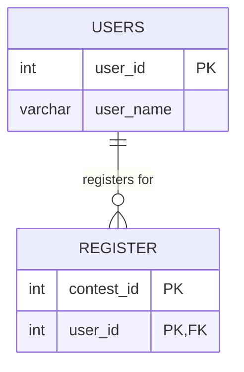

# leetcode : 1633. Percentage of Users Attended a Contest

* [[leetcode : 1633. Percentage of Users Attended a Contest]](https://leetcode.com/problems/percentage-of-users-attended-a-contest/description/)
<br>

---

### **다이어그램**


* `구할거`

<br>

## 문제 풀이

### **MySQL 1**
```SQL
SELECT contest_id, round(100*count(*)/ (select count(*) from users),2) as percentage
FROM register
GROUP BY contest_id
ORDER BY percentage DESC, contest_id ASC
```

* 전체 개수는 users에서 세준다.
* 나머지는 GROUP BY + ORDER BY로 카운팅
  
### **MySQL 2**
```SQL
SELECT 
    R.CONTEST_ID, 
    ROUND(100.0 * COUNT(*) / (SELECT COUNT(*) FROM USERS), 2) AS PERCENTAGE
FROM REGISTER R
GROUP BY R.CONTEST_ID
ORDER BY PERCENTAGE DESC, R.CONTEST_ID ASC
```

* users 테이블 수를 가져오는 부분에서 JOIN + COUNT로 가져오려고 하면 GROUP BY 때문에 집계가 힘들다.
* 값은 USERS에서 바로 SELECT하기.

### **Pandas 1**
```python
def users_percentage(users: pd.DataFrame, register: pd.DataFrame) -> pd.DataFrame:

    n = len(users)

    grouped = register.groupby('contest_id').agg(
        count = ('user_id','count')
    ).reset_index()

    grouped['percentage'] = round(100*grouped['count']/n,2)
    grouped.sort_values(by=['percentage','contest_id'], ascending=[False,True], inplace=True)
    return grouped[['contest_id','percentage']]
```

* shape이든 len이든 count든 users 개수를 세준다.
* 나머지는 group by + sort_values로 정렬해주기.
* 다중 조건에는 by, ascending에 column, bool 전달해주기

### **Pandas 2**
```python
def users_percentage(users: pd.DataFrame, register: pd.DataFrame) -> pd.DataFrame:
    grouped = register.groupby('contest_id').size().reset_index(name='percentage')
    grouped['percentage'] = round(100*grouped['percentage']/len(users),2)
    return grouped.sort_values(by=['percentage','contest_id'], ascending=[False,True])
```

* size를 사용할 땐, 바로 이름할당 가능하니 size + 연산 + round로 답 구하기.

  
<br>

### **코멘트**
* .
