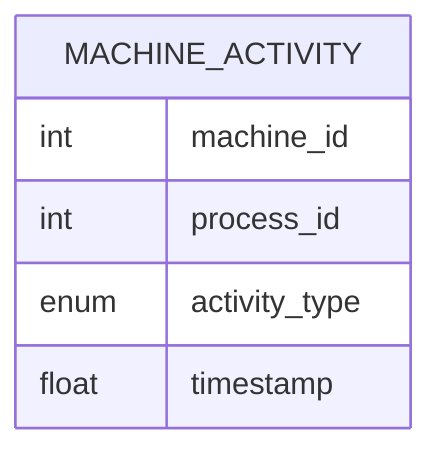

# leetcode : 1661. Average Time of Process per Machine

* [[leetcode : 1661. Average Time of Process per Machine]](https://leetcode.com/problems/average-time-of-process-per-machine/description/)
<br>

---

### **다이어그램**


* `머신 별 가동 시간의 평균`

<br>

## 문제 풀이

### **MySQL 1**
```SQL
WITH START AS (
    SELECT *, SUM(TIMESTAMP) AS SS, COUNT(*) AS SCNT
    FROM ACTIVITY
    WHERE ACTIVITY_TYPE = 'START'
    GROUP BY MACHINE_ID, ACTIVITY_TYPE
),
END AS (
    SELECT *, SUM(TIMESTAMP) AS ES,  COUNT(*) AS ECNT
    FROM ACTIVITY
    WHERE ACTIVITY_TYPE = 'END'
    GROUP BY MACHINE_ID, ACTIVITY_TYPE
)

SELECT S.MACHINE_ID, ROUND((ES-SS)/SCNT,3) AS PROCESSING_TIME
FROM START S
JOIN END E ON S.MACHINE_ID = E.MACHINE_ID
```

* 좀 이상하게 짠거 같지만...
* 시작 시간, 종료 시간 별로 TABLE을 나눈 후, GROUP BY로 시간 합을 구한다.
* JOIN 후, (끝난 시간 합 - 시작 시간)/그룹 별 개수에 반올림해주면 된다.

### **MySQL 2**
```SQL
SELECT
    MACHINE_ID,
    ROUND(2*SUM(IF(ACTIVITY_TYPE='END',TIMESTAMP,-TIMESTAMP))/COUNT(*),3) AS PROCESSING_TIME
FROM ACTIVITY
GROUP BY MACHINE_ID
```

* SUM IF로 바로 계산된 컬럼 하나 생성해주고, COUNT/2로 나눠주기 (START,END) 한 쌍이라 개수 2배임
* GROUP BY + 집계까지 해주기

### **Pandas 1**
```python
def get_average_time(activity: pd.DataFrame) -> pd.DataFrame:
    activity['log'] = np.where(activity['activity_type']=='start',-activity['timestamp'],activity['timestamp'])
    grouped = activity.groupby('machine_id').agg(
        half_processing_time = ('log', 'mean')
    ).reset_index()
    grouped['processing_time'] = round(2*grouped['half_processing_time'],3)
    return grouped[['machine_id','processing_time']]
```

* 다시 보니, start는 음수 붙여서 모두 빼고, end에서는 합으로 모두 더한다.
* 행 개수만 2배가 됐기 때문에 조정해주면 된다.
* np.where로 컬럼 하나 만들어주고 group by + mean으로 값 할당해서 풀이
  
### **Pandas 2**
```python
def get_average_time(activity: pd.DataFrame) -> pd.DataFrame:
    activity['time'] = np.where(activity['activity_type']=='end',
                                activity['timestamp'], -activity['timestamp'])
    grouped = activity.groupby('machine_id').agg(
        processing_time = ('time', lambda group: round(2*group.sum()/group.count(),3))
        ).reset_index()
    return grouped
```

* np.where로 바로 할당하기.
* group에서 바로 연산 진행해주기.
* group 넘어올 때 group['time']으로 넘어오는데, sum(), count(), len()등은 사용 가능하나 size()는 불가
* size() 대신 len() 사용해주기
  
<br>

### **코멘트**
* .