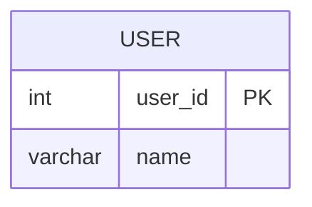

# leetcode : 1667. Fix Names in a Table

* [[leetcode : 1667. Fix Names in a Table]](https://leetcode.com/problems/fix-names-in-a-table/description/)
<br>

---

### **다이어그램**


* `앞 글자를 대문자로 변경하기`

<br>

## 문제 풀이

### **MySQL**
```SQL
SELECT USER_ID, CONCAT(UPPER(LEFT(NAME,1)),LOWER(RIGHT(NAME,LENGTH(NAME)-1))) AS NAME
FROM USERS
ORDER BY USER_ID
```

* CONCAT으로 첫 글짜 바꾸고, 나머지는 모두 소문자로 바꾸기.
  
### **Pandas 1**
```python
def fix_names(users: pd.DataFrame) -> pd.DataFrame:
    users['name'] = users['name'].apply(lambda x: x.capitalize())
    return users.sort_values('user_id')
```

* 파이썬은 대문자 변환해주는 함수가 있다.
* 한 단어는 title, 모든 단어 앞 글자 대문자는 capitalize
  
### **Pandas 2**
```python
def fix_names(users: pd.DataFrame) -> pd.DataFrame:
    users['name'] = users['name'].str.capitalize()
    return users.sort_values('user_id')
```

* 바로 문자열에 접근해서, str capitalize를 사용한다.
  
<br>

### **코멘트**
* 테케 21번에 띄어쓰기로 구분된 케이스가 있어서 title말고 capitalize로 써야한다.
* 악질인게 SQL이랑 PANDAS 답이 다르다.
* SQL에서는 맨 앞글자만 대문자다.