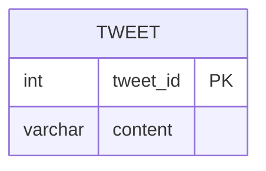

# leetcode : 1683. Invalid Tweets

* [[leetcode : 1683. Invalid Tweets]](https://leetcode.com/problems/invalid-tweets/)
<br>

---

### **다이어그램**


* `트윗 문자열 길이 15보다 큰 사람들의 id`

<br>

## 문제 풀이

### **MySQL**
```SQL
SELECT TWEET_ID
FROM TWEETS
WHERE LENGTH(CONTENT) > 15
```

* 단순 LENGTH 사용
  
### **Pandas 1**
```python
def invalid_tweets(tweets: pd.DataFrame) -> pd.DataFrame:
    return tweets[tweets['content'].str.len()>15][['tweet_id']]
```

* 간단한 조건 걸어주기.
* len(tweets['contest'])로 접근하면 열 전체에 길이가 나와서 안된다.
* 각 행 정보에 접근해야하니 str.len()
  
### **Pandas 2**
```python
def invalid_tweets(tweets: pd.DataFrame) -> pd.DataFrame:
    cond = tweets['content'].str.len() > 15
    return tweets[cond][['tweet_id']]
```

* cond로 조건 생성해서 인자로 넘겨주기.
  
<br>

### **코멘트**
* .
