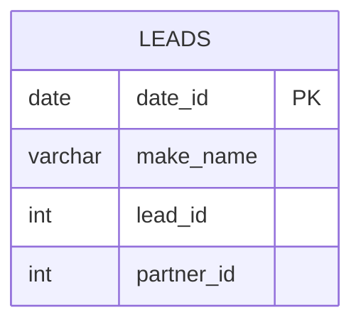

# leetcode : 1693. Daily Leads and Partners

* [[leetcode : Daily Leads and Partners]](https://leetcode.com/problems/daily-leads-and-partners/description/)
<br>

---

### **다이어그램**


* `각 날짜, 이름 별 고유 lead, partner id 개수 카운팅`

<br>

## 문제 풀이

### **MySQL 1**
```SQL
SELECT DATE_ID, MAKE_NAME, COUNT(DISTINCT LEAD_ID) AS UNIQUE_LEADS, COUNT(DISTINCT PARTNER_ID) AS UNIQUE_PARTNERS
FROM DAILYSALES
GROUP BY DATE_ID, MAKE_NAME
```

* 단순 GROUP BY + COUNT DISTINCK 문제
  
### **MySQL 2**
```SQL
SELECT
    DATE_ID AS date_id,
    make_name, 
    COUNT(DISTINCT LEAD_ID) AS unique_leads,
    COUNT(DISTINCT PARTNER_ID) AS unique_partners
FROM DAILYSALES
GROUP BY DATE_ID, MAKE_NAME
```

* 단순 GROUP BY + COUNT DISTINCK 문제
  
### **Pandas**
```python
def daily_leads_and_partners(daily_sales: pd.DataFrame) -> pd.DataFrame:
    grouped = daily_sales.groupby(['date_id','make_name']).agg(
        unique_leads = ('lead_id','nunique'),
        unique_partners = ('partner_id','nunique')
    ).reset_index()
    return grouped
    
```

* 단순 group by + nunique문제

### **Pandas**
```python
def daily_leads_and_partners(daily_sales: pd.DataFrame) -> pd.DataFrame:
    grouped = (daily_sales.groupby(['date_id','make_name']).nunique()
        .reset_index().rename({"lead_id":"unique_leads", "partner_id", "unique_partners" }))
    return grouped
    
```

* 공통으로 nunique를 집계하고, 테이블에 집계 컬럼이 정해져있어서 바로 nunique로 설정하고 rename을 쓰자.
  
<br>

### **코멘트**
* 쉬운문제
