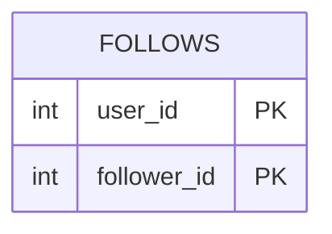

# leetcode : 1729. Find Followers Count
===

* [[leetcode : 1729. Find Followers Count]](https://leetcode.com/problems/find-followers-count/description/)
<br>

---

### **다이어그램**


* `각 유져별로 팔로워 수를 구한다`

<br>

## 문제 풀이

### **MySQL**
```SQL
SELECT USER_ID, COUNT(*) AS FOLLOWERS_COUNT
FROM FOLLOWERS
GROUP BY USER_ID
ORDER BY USER_ID
```

* 단순 GROUP BY + COUNT 문제
  
### **MySQL 2**
```SQL
SELECT USER_ID, COUNT(DISTINCT FOLLOWER_ID) AS FOLLOWERS_COUNT
FROM FOLLOWERS
GROUP BY USER_ID
```

* 중복 팔로잉이 존재할거같아서 COUNT DISTINCT를 사용했다.
  
### **Pandas 1**
```python
import pandas as pd

def count_followers(followers: pd.DataFrame) -> pd.DataFrame:
    grouped = followers.groupby('user_id').agg(
        followers_count = ('follower_id','size')
    ).reset_index()
    return grouped
```

* 단순 group by + count문제
  
### **Pandas 2**
```python
def count_followers(followers: pd.DataFrame) -> pd.DataFrame:

    grouped = followers.groupby(by=['user_id']).agg(
        followers_count = ('follower_id','nunique')
        ).reset_index()
    return grouped
```

* 중복 id가 발생하는걸 고려해서 nunique를 썼는데 정답은 똑같다.

<br>

### **코멘트**
* 쉬운문제