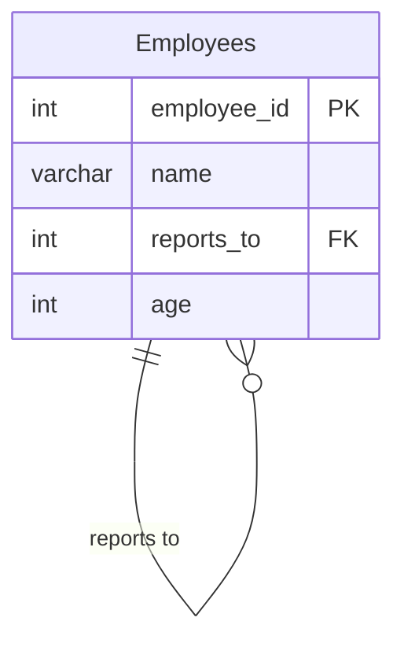

# leetcode : 1731. The Number of Employees Which Report to Each Employee

* [[leetcode : 1731. The Number of Employees Which Report to Each Employee]](https://leetcode.com/problems/the-number-of-employees-which-report-to-each-employee/description/)
<br>

---

### **다이어그램**


* `각 매니저별로 투표 받은 수와 투표자의 평균 나이를 계산`

<br>

## 문제 풀이

### **MySQL 1**
```SQL
WITH TEMP AS (
    SELECT REPORTS_TO AS EMPLOYEE_ID, COUNT(*) AS REPORTS_COUNT, ROUND(AVG(AGE)) AS AVERAGE_AGE
    FROM EMPLOYEES
    WHERE REPORTS_TO IS NOT NULL
    GROUP BY REPORTS_TO
)

SELECT E.EMPLOYEE_ID, E.NAME, T.REPORTS_COUNT, T.AVERAGE_AGE
FROM EMPLOYEES E
JOIN TEMP T ON E.EMPLOYEE_ID = T.EMPLOYEE_ID
ORDER BY E.EMPLOYEE_ID
```

* TEMP에 미리 GRUOP BY + COUNT / ROUND(AVG)로 특정 인원을 뽑은 사람 수와 그 사람들의 평균 나이를 구한다.
* 이후 JOIN
  
### **MySQL 2**
```SQL
WITH REPORTS AS (
    SELECT
        REPORTS_TO AS EMPLOYEE_ID,
        COUNT(*) AS REPORTS_COUNT,
        ROUND(AVG(AGE)) AS AVERAGE_AGE
    FROM EMPLOYEES
    GROUP BY REPORTS_TO
)

SELECT E.EMPLOYEE_ID, E.NAME, R.REPORTS_COUNT, R.AVERAGE_AGE
FROM EMPLOYEES E
JOIN REPORTS R ON E.EMPLOYEE_ID = R.EMPLOYEE_ID
ORDER BY E.EMPLOYEE_ID
```

* 같은 방식으로 풀이.
* 굳이 is not null로 지정을 안해도 된다.

### **Pandas 1**
```python
def count_employees(employees: pd.DataFrame) -> pd.DataFrame:
    grouped = employees.groupby('reports_to').agg(
        reports_count = ('reports_to','count'),
        average_age = ('age',lambda x: int(x.mean()+0.5))
    ).reset_index()

    joined = pd.merge(employees, grouped, left_on='employee_id', right_on='reports_to')
    joined.sort_values(by='employee_id', inplace=True)
    return joined[['employee_id','name','reports_count','average_age']]
```

* gruopby로 count / round를 구해준다. -> 사사오입으로 오류나서 custom function 사용해야 하는듯?
* 이후 merge를 통해 합쳐주고 sort values 사용해주기
  
### **Pandas 2**
```python
def count_employees(employees: pd.DataFrame) -> pd.DataFrame:
    grouped = employees.groupby('reports_to').agg(
        reports_count = ('reports_to','size'),
        average_age = ('age', lambda group : (group.mean()+1e-9).round())
    ).reset_index()

    merged = pd.merge(grouped,employees, left_on='reports_to',right_on='employee_id')
    return merged[['employee_id','name','reports_count','average_age']].sort_values('employee_id')
```

* 0.5 + round를 0.5 + int인줄 알고 조금 삽질했다.
* 마찬가지로 mean 이후 round 해주기.
* 인자로 들어오는 group에서 한 번에 집계를 해준다.

<br>

### **코멘트**
* .
