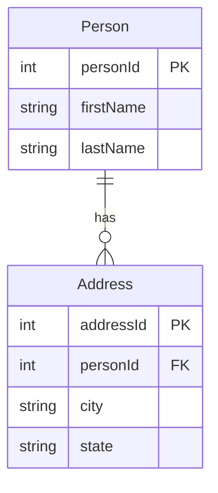

leetcode : 175. combine two table
===

* [[leetcode : 175. combine two table]](https://leetcode.com/problems/combine-two-tables/description/)
<br>

---

## 다이어그램


## 목표
> Write a solution to `report the first name, last name, city, and state of each person` in the Person table. `If the address of a personId is not present in the Address table, report null instead.`
>
>Return the result table in `any order`.
>
> `두 테이블을 조인해서 personId의 주소지 정보를 가져오기. (없으면 NULL)`

<br>

## 문제 풀이

### **MySQL**
```SQL
SELECT
    p.firstName,
    p.lastName,
    a.city,
    a.state
FROM
    person p
LEFT JOIN
    address a ON p.personid = a.personid
```

* PERSON 테이블에 사람 정보가 있으면 Address 테이블에는 사람 정보가 없어도 가져와야한다.

* LEFT JOIN으로 가져오기.
  
### **Pandas**
```python
import pandas as pd

def combine_two_tables(person: pd.DataFrame, address: pd.DataFrame) -> pd.DataFrame:

    joined = pd.merge(person, address,
                      on='personId', how='left')
    cols = ['firstName','lastName','city','state']
    return joined[cols]
```

* PERSON 테이블에 사람 정보가 있으면 Address 테이블에는 사람 정보가 없어도 가져와야한다.

* 재사용을 위해서 가져오기 cols를 따로 정의해주기.
  
<br>

### **코멘트**
* 기본 JOIN 문제