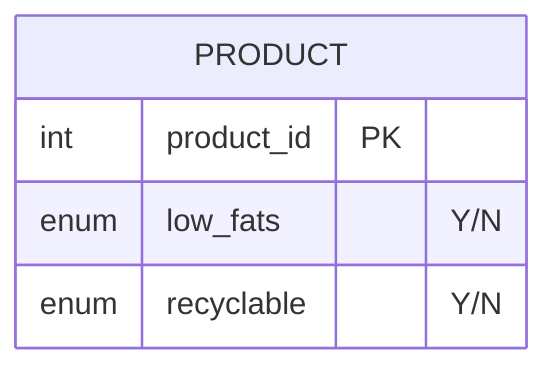

# leetcode : 1757. Recyclable and Low Fat Products


* [[leetcode : 1757. Recyclable and Low Fat Products]](https://leetcode.com/problems/recyclable-and-low-fat-products/description/)
<br>

---

### **다이어그램**


* `특정 컬럼이 둘다 y인 row`

<br>

## 문제 풀이

### **MySQL**
```SQL
SELECT PRODUCT_ID
FROM PRODUCTS
WHERE LOW_FATS='Y' AND RECYCLABLE='Y'
```

* .
  
### **Pandas**
```python
def find_products(products: pd.DataFrame) -> pd.DataFrame:
    return products[(products['low_fats']=='Y') & (products['recyclable']=='Y')][['product_id']]
    
```

* .
  
<br>

### **코멘트**
* .