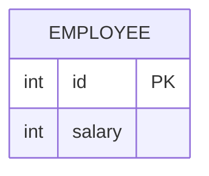

leetcode : 176. Second Highest Salary
===

* [[link]](https://leetcode.com/problems/second-highest-salary/description/)
<br>

---

### 다이어그램


### 목표
> Write a solution to `find the second highest distinct salary` from the Employee table. `If there is no second highest salary, return null (return None in Pandas).`
>
>Return the result table.

<br>

## 문제 풀이

### **MySQL**
```SQL
-- SOLUTION1 : 내 풀이
WITH SALARY_RANKING AS (
    SELECT 
        SALARY,
        ROW_NUMBER() OVER (ORDER BY SALARY DESC) AS IDX
    FROM
        (SELECT DISTINCT SALARY FROM EMPLOYEE) SUB
)
SELECT 
    COALESCE((SELECT SALARY FROM SALARY_RANKING WHERE IDX = 2), NULL) AS SecondHighestSalary;


-- SOLUTION2 : 빠른 풀이
WITH salary_rnk as (
    SELECT *, DENSE_RANK() OVER (order by salary DESC) as rnk
    FROM Employee)

SELECT ( SELECT salary FROM salary_rnk WHERE rnk=2 LIMIT 1) as SecondHighestSalary
```

* SOLUTION 1: ROWNUMBER + CTE를 사용.
  * CTE를 사용해서 서브쿼리처럼 안에 반환값이 없는경우 null을 받을 수 없기 때문에 쿼리를 한 번 더 돌려서 복잡도가 올라갔다.
  
* SOLUTION 2: DENSE RANK + SUBQUERY
  * DISTINCT + ROW_NUMBER 대신, DENSE_RANK를 사용해서 고유값만 사용하기.
  * SELECT + 서브쿼리 구문에서 없으면 null 반환이라 따로 COALESCE를 사용할 필요가 없다.
  
### **Pandas**
```python

# Solution 1
def second_highest_salary(employee: pd.DataFrame) -> pd.DataFrame:
    salary_dense_rank = pd.DataFrame({'salary':
                                    sorted(employee['salary'].unique(),reverse=True)})

    if len(salary_dense_rank) < 2:
        answer = None
    else:
        answer = salary_dense_rank['salary'].iloc[1]

    return pd.DataFrame({'SecondHighestSalary': [answer]})


# Solution 2
def second_highest_salary(employee: pd.DataFrame) -> pd.DataFrame:
    employee['salary_dense_rank'] = employee['salary'].rank(method='dense', ascending=False)
    second_highest = employee[employee['salary_dense_rank'] == 2]['salary']
    if second_highest.empty:
        answer = None
    else:
        answer = second_highest.iloc[0]
    
    return pd.DataFrame({'SecondHighestSalary': [answer]})

# Solution 3
def second_highest_salary(employee: pd.DataFrame) -> pd.DataFrame:
    df = employee.copy()
    df = df.drop_duplicates(subset='salary').sort_values('salary', ascending=False)
    if len(df) >=2:
        df = df.iloc[1]['salary']
        return pd.DataFrame(data=[df], columns=['SecondHighestSalary'])
    else:
        return pd.DataFrame(data=[None], columns=['SecondHighestSalary'])


# Solution 4
def second_highest_salary(employee: pd.DataFrame) -> pd.DataFrame:
    unique_salaries = employee['salary'].drop_duplicates()
    if len(unique_salaries) < 2:
        answer = None
    else:
        answer = unique_salaries.nlargest(2).iloc[-1]
    
    return pd.DataFrame({'SecondHighestSalary': [answer]})
```

* SOLUTION 1: sorted
 
* SOLUTION 2: dense rank
  
* SOLUTION 3: sort values
    * 시간 효율성 best 풀이

* SOLUTION 4: drop duplicate + nlargest
  * O(N) + 남은 K개 중 KlogK라서 이게 제일 빠를거같은데, 아닌듯... 샘플이 작아서 큰 의미는 없긴한데

<br>

### **코멘트**
* 시복은 똑같은데 한참 느려서 여러 번 풀었음...
