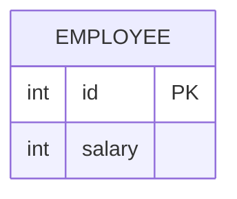

leetcode : 177. Nth Highest Salary
===

* [[leetcode : 177. Nth Highest Salary]](https://leetcode.com/problems/nth-highest-salary/description/)
<br>

---

### 다이어그램


### 목표
> `find the nth highest salary from the Employee table`
> `If there is no nth highest salary, return null.`

<br>

## 문제 풀이

### **MySQL**
```SQL
CREATE FUNCTION getNthHighestSalary(N INT) RETURNS INT
BEGIN
    DECLARE result INT;

    WITH TEMP AS (
        SELECT SALARY, DENSE_RANK() OVER (ORDER BY SALARY DESC) AS DENSE_RANKING
        FROM EMPLOYEE
    )
    SELECT SALARY INTO result
    FROM TEMP
    WHERE DENSE_RANKING = N
    LIMIT 1;

    RETURN result;
END
```

* 함수 선언하는 형태가 익숙하진 않은데, 안쪽에서 쿼리만 작성해주면 된다.

* DENSE RANK + LIMIT (LIMIT를 사용해야 값이 없어도 null 처리를 해준다.)
  
### **Pandas**
```python
import pandas as pd

def nth_highest_salary(employee: pd.DataFrame, N: int) -> pd.DataFrame:
    unique_salaries = employee['salary'].drop_duplicates()
    top_n_salaries = unique_salaries.nlargest(N)

    if len(top_n_salaries) < N:
        answer = None
    else:
        top_n_salaries = unique_salaries.nlargest(N)
        if N>0:
            answer = top_n_salaries.iloc[N-1]
        else:
            answer = None
    
    return pd.DataFrame({f'getNthHighestSalary({N})': [answer]})

```

* 중복 제거 후, 상위 N개 뽑기

* N개보다 작거나, N에 양수가 아닌 값이 들어오면 예외처리 None
  
<br>

### **코멘트**
* 코멘트
