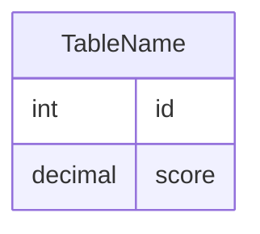

leetcode : 178. Rank Scores
===

* [[leetcode : 178. Rank Scores]](https://leetcode.com/problems/rank-scores/description/)
<br>

---

### 다이어그램


### 목표
> Write a solution to `find the rank of the scores`. The ranking should be calculated according to the following rules:
> The scores should be ranked from the highest to the lowest.
> `If there is a tie between two scores, both should have the same ranking.`
> After a tie, the next ranking number should be the next consecutive integer value. In other words, there should be no holes between ranks.
> Return the result table ordered by score in descending order.
>
> `동일 점수는 같은 등수로 취급해서 점수 내림차순으로 점수랑 랭킹 반환하기`

<br>

## 문제 풀이

### **MySQL**
```SQL
SELECT
    SCORE,
    DENSE_RANK() OVER (ORDER BY SCORE DESC) AS `RANK`
FROM 
    SCORES
```

* 기본적인 DENSE_RANK() 사용법을 묻는 문제.
  
### **Pandas**
```python
import pandas as pd

def order_scores(scores: pd.DataFrame) -> pd.DataFrame:
    scores['rank'] = scores['score'].rank(method='dense', ascending=False)
    return scores[['score','rank']].sort_values('rank')
```

* rank(method='dense') + sort_values
  
<br>

### **코멘트**
* .
