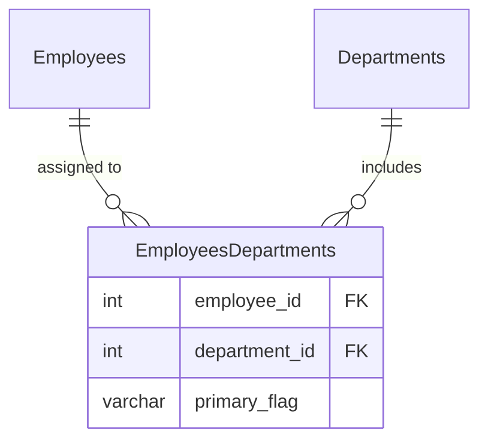

# leetcode : 1789. Primary Department for Each Employee

===

* [[leetcode : 1789. Primary Department for Each Employee]](https://leetcode.com/problems/primary-department-for-each-employee/description/)
<br>

---

### **다이어그램**


* `각 사람들의 메인 부서 찾기`
* 부서가 여러개면 Y FLAG를 찾아준다.
* 아닌 경우 GROUP BY + COUNT에서 COUNT가 1인거를 UNION

<br>

## 문제 풀이

### **MySQL 1**
```SQL
SELECT EMPLOYEE_ID, DEPARTMENT_ID
FROM EMPLOYEE
GROUP BY EMPLOYEE_ID
HAVING COUNT(*) = 1

UNION

SELECT EMPLOYEE_ID, DEPARTMENT_ID
FROM EMPLOYEE
WHERE PRIMARY_FLAG = 'Y'
```

* GROUP BY + HAVING으로 부서가 한 개인 사람만 구하기
* WHERE 조건으로 PRIMARY 부서가 지정된 (부서 두 개 이상인) 사람 구하기
  
### **MySQL 2**
```SQL
WITH TEMP AS (
    SELECT
    EMPLOYEE_ID,
    DEPARTMENT_ID,
    ROW_NUMBER() OVER (PARTITION BY EMPLOYEE_ID
                    -- ORDER BY PRIMARY_FLAG DESC, DEPARTMENT_ID ASC) AS RN
                    ORDER BY PRIMARY_FLAG ASC, DEPARTMENT_ID ASC) AS RN
    FROM EMPLOYEE
)

SELECT EMPLOYEE_ID, DEPARTMENT_ID
FROM TEMP
WHERE RN = 1
```

* 각 사람별로 GROUP BY + ROW NUMBER를 걸어준다.
* 정렬 조건에 FLAG가 Y인 사람이 먼저 올 수 있게 DESC로 가져온다.
  * 원래대로면 DESC가 맞는데, DESC로 정렬기준을 PRIMARY_FLAG에 주면 Y보다 N이 먼저 나온다;
* 나머지는 DEPN ID로 가져오기.

  
### **Pandas 1**
```python
def find_primary_department(employee: pd.DataFrame) -> pd.DataFrame:
    employee.sort_values(by=['employee_id', 'primary_flag'], inplace=True)
    employee.drop_duplicates(subset='employee_id', keep='last', inplace=True)
    return employee[['employee_id', 'department_id']]
```

* sort_values + drop_duplicates
* y는 각 사람별로 한 번만 나온다는점을 생각해서 사람별로 flag를 정렬한다.
* keep last를 걸어놓으면 마지막이 y인 부서를 가져올 수 있다.

### **Pandas 2**
```python
def find_primary_department(employee: pd.DataFrame) -> pd.DataFrame:
    employee = employee.sort_values(by=['employee_id','primary_flag','department_id'],
                                    ascending=[True,False,True])
    employee['rn'] = employee.groupby('employee_id').cumcount()
    return employee[employee['rn']==0][['employee_id','department_id']]
```

* 정렬 + cumcount로 groupby별 row number 구하기.
* row number가 0인 row 뽑기.
  
<br>

### **코멘트**
* .
