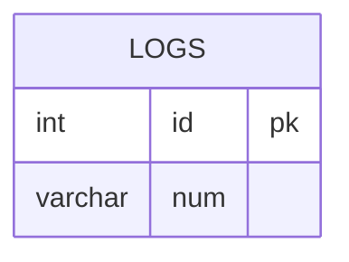

leetcode : 180. Consecutive Numbers
===

* [[180. Consecutive Numbers]](https://leetcode.com/problems/consecutive-numbers/)
<br>

---

### 다이어그램


### 목표
> Find `all numbers that appear at least three times consecutively.`
> Return the result table in any order.
> `연속 3개 이상 나오는 숫자들 구하기`
> `ID는 AUTO INC`

<br>

## 문제 풀이

### **MySQL**
```SQL
-- SOLUTION 1
WITH TEMP AS (
    SELECT
        ID, NUM,
        MIN(NUM) OVER (ORDER BY ID ROWS BETWEEN 2 PRECEDING AND CURRENT ROW) AS MIN_WINDOW,
        MAX(NUM) OVER (ORDER BY ID ROWS BETWEEN 2 PRECEDING AND CURRENT ROW) AS MAX_WINDOW,
        COUNT(NUM) OVER (ORDER BY ID ROWS BETWEEN 2 PRECEDING AND CURRENT ROW) AS CNT
    FROM LOGS
)
SELECT DISTINCT(NUM) AS ConsecutiveNums 
FROM TEMP
WHERE min_window = max_window AND CNT >= 3;

-- SOLUTION 2
WITH TEMP AS (
    SELECT
        ID, NUM,
        LAG(NUM, 1) OVER (ORDER BY ID) AS PREV_NUM,
        LEAD(NUM, 1) OVER (ORDER BY ID) AS NEXT_NUM
    FROM LOGS
)
SELECT DISTINCT NUM AS ConsecutiveNums
FROM TEMP
WHERE NUM = PREV_NUM AND NUM = NEXT_NUM;
```

* SOLUTION 1 : WINDOW + MIN/MAX
  * 크기 3 윈도우에서 MIN MAX값이 같고, 크기 3이 만족이 되면 (테이블 양 끝쪽이 아니면) 출력하기.
  
* SOLUTION 2 : LEAD / LAG
  * LEAD LAG로로 주변 값 1개씩 비교하기.


  
### **Pandas**
```python
# SOLUTION 1
def consecutive_numbers(logs: pd.DataFrame) -> pd.DataFrame:
    logs['window_max'] = logs['num'].rolling(window=3).max()
    logs['window_min'] = logs['num'].rolling(window=3).min()
    cond1 = logs['window_min'] == logs['window_max']
    return logs[cond1][['num']].drop_duplicates('num').rename(columns={'num':'ConsecutiveNums'})

# SOLUTION 2
def consecutive_numbers(logs: pd.DataFrame) -> pd.DataFrame:
    logs['prev_num'] = logs['num'].shift(1)
    logs['next_num'] = logs['num'].shift(-1)

    cond1 = logs['num']==logs['prev_num']
    cond2 = logs['num']==logs['next_num']
    return logs[cond1&cond2][['num']].drop_duplicates('num').rename(columns={'num':'ConsecutiveNums'})
```

* SOLUTION 1 : rolling + min/max
  * 크기 3 윈도우에서 MIN MAX값이 같고, 크기 3이 만족이 되면 (테이블 양 끝쪽이 아니면) 출력하기.
  
* SOLUTION 2 : shift
  * shift가 양수면 위에서 아래로 푸시 해줘서 값이 밀려나는 것으로 생각하면 된다.
  * shift(1)이면 첫 줄에는 none
  
<br>

### **코멘트**
* 윈도우 함수 정리하기!
