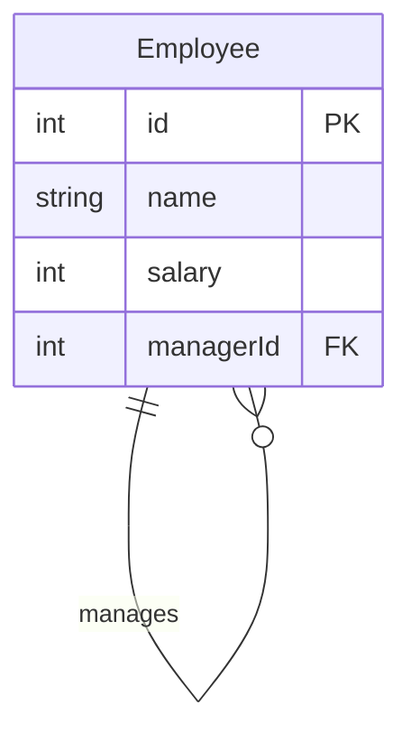

leetcode : 181. Employees Earning More Than Their Managers
===

* [[leetcode : 181. Employees Earning More Than Their Managers]](https://leetcode.com/problems/employees-earning-more-than-their-managers/description/)
<br>

---

## 다이어그램


## 목표
>Write a solution to `find the employees who earn more than their managers.`
>
>Return the result table in any order.
>
>`매니저보다 돈 많이버는 사원 이름 출력하기`

<br>

## 문제 풀이

### **MySQL**
```SQL
-- SOLUTION 1
-- 매니저가 아닌 사원들 CTE로 놓고, JOIN
WITH IS_NOT_MANAGER AS (
    SELECT
        *
    FROM 
        Employee
    WHERE
        managerId IS NOT NULL
)

SELECT
    i.name as Employee
FROM
    IS_NOT_MANAGER i
JOIN
    Employee e ON e.id = i.managerId
WHERE
    e.salary < i.salary

-- SOLUTION 2
-- SELF JOIN : 명시적
SELECT e1.name as Employee
FROM Employee e1
JOIN Employee e2 ON e1.managerId = e2.id
WHERE e1.salary > e2.salary

-- SOLUTION 3
-- SELF JOIN : 암시적
select e1.name as Employee from Employee e1, Employee e2
where e1.managerId = e2.id
and e1.salary > e2.salary
```

* 어짜피 self join 과정에서 null 데이터는 조인이 안돼서 굳이 cte를 작성할 필요는 없었다.

* self join 사용 시, sol3 보다는 sol2처럼 명시적으로 JOIN을 사용해서 가독성 높이기.
  
### **Pandas**
```python
import pandas as pd

def find_employees(employee: pd.DataFrame) -> pd.DataFrame:

    joined = pd.merge(employee, employee,
                     left_on='managerId', right_on='id',
                     suffixes=('_employee', '_manager'))
    
    cond = joined['salary_employee'] > joined['salary_manager']
    
    return joined[cond][['name_employee']].rename(columns={'name_employee': 'Employee'})
```

* 조인 컬럼명이 달라서 left right on을 사용한다.

* 기준 테이블을 명시하기 위해 suffixes를 사용한다.

* 조건 같은경우 재사용이 가능하게 변수에 할당한다.
  * 명명 규칙도 정하면 좋을듯..

* rename을 통해서 변경 컬럼명 전달해주기.
  
<br>

### **코멘트**
* .
