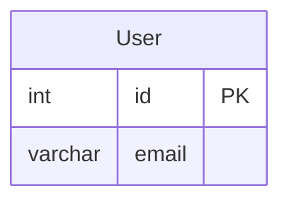

leetcode : 182. Duplicate Emails
===

* [[leetcode : 182. Duplicate Emails]](https://leetcode.com/problems/duplicate-emails/description/)
<br>

---

### 다이어그램


### 목표
>Write a solution to `report all the duplicate emails.` Note that it's guaranteed that the email field is not NULL.
>
>Return the result table in any order.

<br>

## 문제 풀이

### **MySQL**
```SQL
# Solution 1
SELECT EMAIL
FROM PERSON
GROUP BY EMAIL
HAVING COUNT(*) > 1
```

* Solution1 : GROUP BY + HAVING
  
### **Pandas**
```python
# Solution 1
def duplicate_emails(person: pd.DataFrame) -> pd.DataFrame:
    
    email_count = person['email'].value_counts().reset_index()
    cond = email_count['count'] >= 2
    return email_count[cond][['email']].rename(columns={'email':'Email'})

    # email_count = pd.DataFrame(person['email'].value_counts()).reset_index(names=['Email','count'])
    # cond = email_count['count'] >= 2
    # return email_count[cond][['Email']]
```

* solution 1:  value_counts

  * 기준 이메일도 반환하기 위해서 reset index 사용.

  * 반환된 시리즈를 데이터프레임으로 만들어서 바로 reset_index의 names로 넣는것도 나쁘지 않아보인다.

  * columns는 rename하거나 capitalize하거나
  
<br>

### **코멘트**
* .
