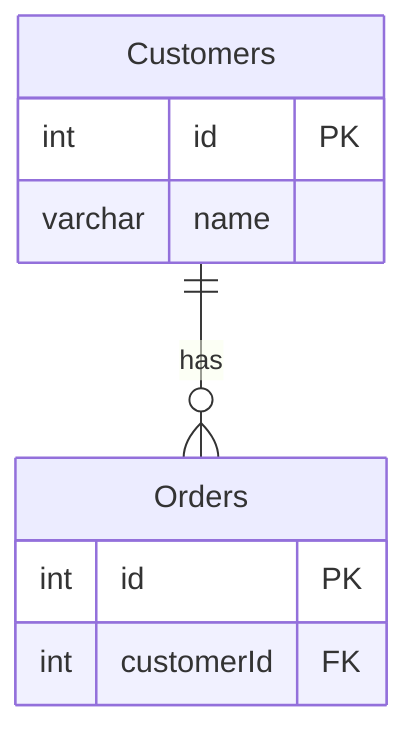

leetcode : 183. Customers Who Never Order
===

* [[leetcode : 183. Customers Who Never Order]](https://leetcode.com/problems/customers-who-never-order/description/)
<br>

---

### 다이어그램


### 목표
>Write a solution to `find all customers who never order anything.`
>Return the result table in `any order.`

<br>

## 문제 풀이

### **MySQL**
```SQL
-- SOLUTION 1
SELECT NAME AS CUSTOMERS
FROM CUSTOMERS C
LEFT JOIN ORDERS O ON C.ID = O.CUSTOMERID
WHERE O.CUSTOMERID IS NULL

-- SOLUTION 2
SELECT NAME AS CUSTOMERS
FROM CUSTOMERS
WHERE ID NOT IN (SELECT CUSTOMERID FROM ORDERS)

-- SOLUTION 3
SELECT NAME as Customers
FROM CUSTOMERS C
WHERE NOT EXISTS (SELECT 1 FROM ORDERS O WHERE C.ID = O.CUSTOMERID)
```

* Solution 1: LEFT JOIN + IS NULL
  * LEFT JOIN을 사용하면, CUSTOMER ID가 있는 사람 아닌 사람이 NULL로 구분이 된다.

* Solution 2: 서브쿼리
  * ID가 CUSTOMERID에 있는지 확인

* Solution 3: NOT EXISTS
  * 메모리 오버헤드가 적은 NOT EXISTS
  
### **Pandas**
```python
# SOLUTION 1
import pandas as pd

def find_customers(customers: pd.DataFrame, orders: pd.DataFrame) -> pd.DataFrame:
    join = pd.merge(customers, orders, left_on='id', right_on='customerId', how='left')
    return join[join['customerId'].isnull()][['name']].rename(columns={'name':'Customers'})

# SOLUTION 2
def find_customers(customers: pd.DataFrame, orders: pd.DataFrame) -> pd.DataFrame:
    answer = customers[~customers['id'].isin(orders['customerId'])][['name']]
    answer.rename(columns={'name': 'Customers'}, inplace=True)
    return answer
```

* Solution 1: merge lefet + isnull
  * NULL값을 찾을 때 isnull()을 사용하기
  
* Solution 2: isin
  * ~을 통해서 불리언 인덱스들을 반전시킨다.
  
<br>

### **코멘트**
* 풀이가 같은데도 동작시간이 좀 차이가 나는듯?