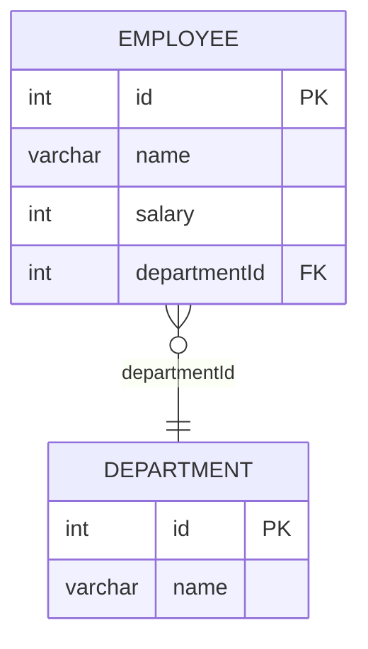

leetcode : 184. Department Highest Salary
===

* [[leetcode : 184. Department Highest Salary]](https://leetcode.com/problems/department-highest-salary/description/)
<br>

---

### **다이어그램**


### **목표**
> Write a solution to `find employees who have the highest salary in each of the departments.`
> `부서마다 연봉 1위인 사원 조회하기`

<br>

## **문제 풀이**

### **MySQL**
```SQL
--  Solution 1
WITH TEMP AS (
    SELECT
        *,
        DENSE_RANK() OVER (PARTITION BY DEPARTMENTID ORDER BY SALARY DESC) AS SALARY_RANK
    FROM EMPLOYEE
)

SELECT
    D.NAME AS DEPARTMENT,
    T.NAME AS EMPLOYEE,
    T.SALARY AS SALARY
FROM
    TEMP T
JOIN
    DEPARTMENT D ON T.DEPARTMENTID = D.ID
WHERE
    T.SALARY_RANK = 1
```

* SOLUTION 1: DENSE_RANK + JOIN
  * 각 부서별로 DENSE RANK를 구한 후, 1등인 사람들만 JOIN으로 조회
  * PARTITION BY가 ORDER BY보다 먼저 와야한다.
  
### **Pandas**
```python
# Solution 1
def department_highest_salary(employee: pd.DataFrame, department: pd.DataFrame) -> pd.DataFrame:
    employee['rank'] = employee.groupby('departmentId')['salary'].rank(method='dense', ascending=False)
    high_salary_employee = employee[employee['rank'] == 1]
    answer = pd.merge(high_salary_employee, department,
                        left_on='departmentId', right_on='id',
                        suffixes=('_high_salary_employee', '_department'))
    answer.rename(columns = {'name_department':'Department','name_high_salary_employee':'Employee', 'salary':'Salary'}, inplace=True)
    return answer[['Department','Employee','Salary']]

# Solution 2
def department_highest_salary(employee: pd.DataFrame, department: pd.DataFrame) -> pd.DataFrame:

    employee = employee.sort_values(['departmentId', 'salary'], ascending=[True, False])
    top_salary = employee[['salary', 'departmentId']].drop_duplicates(subset=['departmentId'], keep='first')
    cond = employee[['salary', 'departmentId']].apply(tuple, axis=1).isin(top_salary.apply(tuple,axis=1))
    top_salary_emp = employee[cond]

    answer = pd.merge(top_salary_emp, department,
                        left_on='departmentId',right_on='id',how='left')
    return answer[['name_y','name_x','salary']].rename(columns={'name_y':'Department',
    'name_x':'Employee', 'salary':'Salary'})
```

* Solution 1: + dense rank + join
  * dense rank로 등수를 매겨준 뒤 1등인 사람을 찾고 join.
  * 어렵지 않다.

* Solution 2: sort_values + drop_duplicates + join
  * 각 부서에서 1등인 사람들만 모아놓으면, 테이블 크기가 충분히 줄어들어서 isin도 효과적으로 작동할 것이라고 생각했음.
  * 한 가지 신경쓸 점이라면, 테이블의 크기가 같지 않아서 isin으로 비교를 해야한다.
  * 데이터 프레임끼리 비교가 아니라, 내부 레코드끼리 비교라서 apply tuple로 각 row를 튜플로 만들어야한다.
  * solution 1보다 빠르게 나왔다.
  
<br>

### **코멘트**
* pandas에서 nlargest로 뽑아내거나, groupby + max로 뽑는 등 다양하게 접근이 가능하다.
