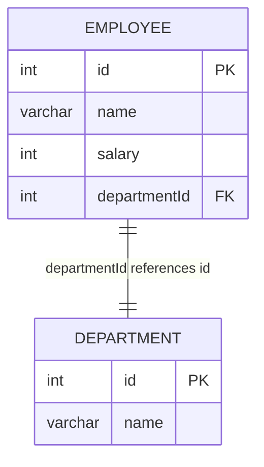

leetcode : 185. Department Top Three Salaries
===

* [[leetcode : 185. Department Top Three Salaries]](https://leetcode.com/problems/department-top-three-salaries/description/)
<br>

---

### 다이어그램


### **목표**
> A company's executives are interested in seeing who earns the most money in each of the company's departments. A high earner in a department is an employee who has a salary in the top three unique salaries for that department.
>
> Write a solution to `find the employees who are high earners in each of the departments.`


<br>

## 문제 풀이

### **MySQL**
```SQL
-- Solution 1
WITH TEMP AS (
    SELECT
        *,
        DENSE_RANK() OVER (PARTITION BY DEPARTMENTID ORDER BY SALARY DESC) AS SALARY_RANK
    FROM
        EMPLOYEE
)

SELECT
    D.NAME AS DEPARTMENT,
    T.NAME AS EMPLOYEE,
    T.SALARY
FROM
    TEMP T
JOIN
    DEPARTMENT D ON T.DEPARTMENTID = D.ID
WHERE
    SALARY_RANK <= 3
```

* Solution 1: DENSE_RANK + JOIN
  * 이전 문제와 마찬가지로 DENSE RANK + JOIN에 WHERE 조건을 걸어주면 된다.
  * 이게 왜 하드?
  
### **Pandas**
```python
# Solution 1
def top_three_salaries(employee: pd.DataFrame, department: pd.DataFrame) -> pd.DataFrame:
    employee['salary_rank'] = (employee.groupby('departmentId')['salary']
                                .rank(method='dense',ascending=False))

    cond = employee['salary_rank']<=3
    merged = (pd.merge(employee[cond], department,
                        left_on='departmentId',right_on='id', how='left')
        .rename(columns={'name_y':'Department', 'name_x':'Employee','salary':'Salary'}))                
    return merged[['Department','Employee','Salary']]
```

* Solution 1: rank + merge
  * 가장 큰 값만 찾는게 아니다보니까, agg로 nlargest로 적용하기에는 중복값들로 3개가 채워져서 온전히 구하지 못한다.
  
<br>

### **코멘트**
* .
