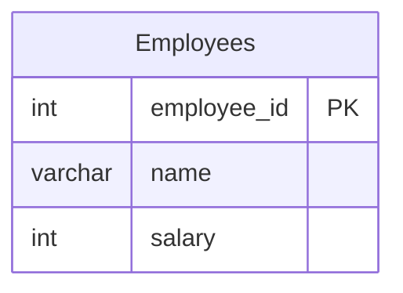

# leetcode : 1873. Calculate Special Bonus

* [[link]](https://leetcode.com/problems/calculate-special-bonus/description/)
<br>

---

### **다이어그램**


* `인덱스 짝수이면서 M이 아닌 사람의 보너스 구하기`

<br>

## 문제 풀이

### **MySQL**
```SQL
SELECT EMPLOYEE_ID, IF(EMPLOYEE_ID%2=0 OR SUBSTR(NAME,1,1)='M',0,SALARY) AS BONUS
FROM EMPLOYEES
ORDER BY EMPLOYEE_ID
```

* CASE WHEN보다 IF 내에 OR로 조건걸어서 쓰는게 더 깔끔해보인다.
* AND 대신 OR쓰는게 더 빨라서 OR 사용.
  
### **MySQL**
```SQL
SELECT 
    EMPLOYEE_ID,
    IF(NAME NOT LIKE "M%" AND EMPLOYEE_ID%2=1 , SALARY, 0) AS BONUS
FROM EMPLOYEES
ORDER BY EMPLOYEE_ID
```

* SUBSTR이나 LEFT 대신 LIKE 사용해서 풀이.
  
### **Pandas**
```python
import pandas as pd

def calculate_special_bonus(employees: pd.DataFrame) -> pd.DataFrame:
    employees['bonus'] = np.where((employees['employee_id']%2==0) | (employees['name'].str[0] == 'M'), 0, employees['salary'])
    return employees[['employee_id', 'bonus']].sort_values(by='employee_id')
```

* 숏서킷을 사용해서 풀이.
* OR에서 하나만 True여도 나머지는 검사를 안해도 되니까, 조건이 많을 때 효율적이다.

### **Pandas**
```python
def calculate_special_bonus(employees: pd.DataFrame) -> pd.DataFrame:
    employees['bonus'] = np.where((employees['employee_id']%2==1)&((employees['name'].str)[0]!='M'),
                                    employees['salary'],0)
    return employees[['employee_id','bonus']].sort_values(by='employee_id')
```

* 이전에는 숏서킷으로 풀었는데, 지금은 그냥 조건 주어진대로 작성했다.
* 데이터 분포를 알고 있어서 쿼리 작성에 크게 이득을 볼 수 있는게 아니면 문제 풀이시에는 주어진대로 작성하자.
  
<br>

### **코멘트**
* M으로 시작하는 것 보다, M으로 시작하지 않는 것이 더 많은 imbalanced라서 고려해서 풀었으면 더 좋았을 듯?
