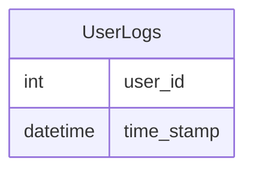

# leetcode : 1890. The Latest Login in 2020

* [[leetcode : 1890. The Latest Login in 2020]](https://leetcode.com/problems/the-latest-login-in-2020/description/)
<br>

---

### **다이어그램**


* `2020년 로그 중 가장 마지막 로그 (유저 별)`

<br>

## 문제 풀이

### **MySQL 1**
```SQL
SELECT USER_ID, MAX(TIME_STAMP) AS LAST_STAMP
FROM LOGINS
WHERE YEAR(TIME_STAMP) = '2020'
GROUP BY USER_ID
```

* GROUP BY + MAX

### **MySQL 2**
```SQL
WITH TEMP AS (
SELECT *, ROW_NUMBER() OVER (PARTITION BY USER_ID ORDER BY TIME_STAMP DESC) AS RN
FROM (SELECT *
    FROM LOGINS
    WHERE YEAR(TIME_STAMP) = 2020) T)

SELECT USER_ID, TIME_STAMP AS LAST_STAMP
FROM TEMP
WHERE RN = 1
```

* WHERE + ROW_NUMBER + WHERE로 풀이.
* 간단한 조건문만 있는 경우, CTE말고 서브쿼리도 괜찮은듯

  
### **Pandas 1**
```python
def latest_login(logins: pd.DataFrame) -> pd.DataFrame:
    logins.sort_values(by='time_stamp', inplace=True)
    answer = logins[logins['time_stamp'].dt.year == 2020].drop_duplicates(subset='user_id', keep='last')
    return answer.rename(columns={'time_stamp': 'last_stamp'})
```

* sort_values + drop duplicate
* DESC 정렬에 keep first가 더 효율적인 것 같음.

### **Pandas 2**
```python
def latest_login(logins: pd.DataFrame) -> pd.DataFrame:
    log2020 = logins[logins['time_stamp'].dt.year==2020]
    grouped = log2020.groupby('user_id').max().reset_index().rename(columns={'time_stamp':'last_stamp'})
    return grouped
```

* cond + groupby + max
  
<br>

### **코멘트**
* .
