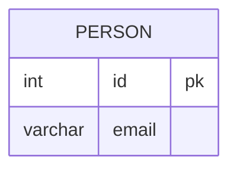

leetcode : 196. Delete Duplicate Emails
===

* [[leetcode : 196. Delete Duplicate Emails]](https://leetcode.com/problems/delete-duplicate-emails/description/)
<br>

---

### **다이어그램**


### **목표**
>Write a solution to `delete all duplicate emails, keeping only one unique email with the smallest id.`
> `중복 이메일을 제거 (테이블 수정하기)`

<br>

## **문제 풀이**

### **MySQL**
```SQL
-- Solution 1
WITH TEMP AS (
    SELECT MIN(id) AS MIN_ID, EMAIL
    FROM PERSON
    GROUP BY EMAIL
)

DELETE P
FROM PERSON P
JOIN TEMP T ON P.EMAIL = T.EMAIL
WHERE ID != MIN_ID
```

* GROUP BY로 사람마다 MIN ID랑 EMAIL을 찾는다.

* 기존 테이블과 JOIN으로 결합하여, MIN_ID = ID가 아닌 행들을 DELETE로 제거한다.
  
### **Pandas**
```python
# Solution 1
import pandas as pd

def delete_duplicate_emails(person: pd.DataFrame) -> None:
    person.sort_values('id', inplace=True)
    person.drop_duplicates(subset=['email'],keep='first', inplace=True)
```
* inplace를 안쓰는 방향으로 업데이트를 하고있어서 inplace를 피해야하는데, person이 global로 설정되어있어서 inplace를 써야한다.

* 리턴값으로 받아서 수정하는게 더 낫지 않나 싶다...
  
<br>

---


### **코멘트**
* DML 아닌 구문들도 리마인드 자주 하기.
