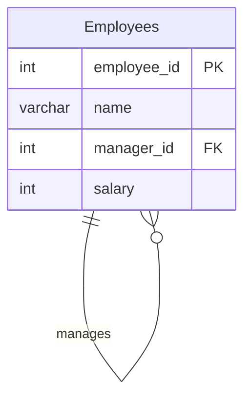

# leetcode : 1978. Employees Whose Manager Left the Company

* [[leetcode : 1978. Employees Whose Manager Left the Company]](https://leetcode.com/problems/employees-whose-manager-left-the-company/description/)
<br>

---

### **다이어그램**


* `salary 30000만 미만이고, 상사가 회사에 있는 emp_id`

<br>

## 문제 풀이

### **MySQL 1**
```SQL
SELECT employee_id
FROM EMPLOYEES
WHERE SALARY < 30000 AND MANAGER_ID IS NOT NULL AND MANAGER_ID NOT IN (SELECT employee_id FROM EMPLOYEES)
ORDER BY employee_id
```

* not in 은 subquery 사용주기
  
### **MySQL 2**
```SQL
SELECT EMPLOYEE_ID
FROM EMPLOYEES
WHERE
    SALARY < 30000 AND 
    MANAGER_ID IS NOT NULL AND
    MANAGER_ID NOT IN (SELECT EMPLOYEE_ID FROM EMPLOYEES)
ORDER BY EMPLOYEE_ID ASC
```

* 같은 방법으로 풀었다.
* 다중 컬럼, 조건, 조인 등 쿼리가 길어지는 경우, 가독성을 위해서 들여쓰기
  
### **Pandas 1**
```python
def find_employees(employees: pd.DataFrame) -> pd.DataFrame:
    answer = employees[(employees['salary']<30000) & (~employees['manager_id'].isin(employees['employee_id']))].dropna()
    return answer[['employee_id']].sort_values('employee_id')
```

* 조건 2개 걸어주기.
* 매니저 조건 걸어줄 때 '매니저가 있고 & 떠난' 이라는 복합조건이므로 매니저가 null인 데이터는 볼 필요 없다.
* dropna부터 해주는게 조금 더 빨랐을듯?
  
### **Pandas 2**
```python
def find_employees(employees: pd.DataFrame) -> pd.DataFrame:

    cond = (employees['salary'] < 30000) & (~employees['manager_id'].isna()) & (~employees['manager_id'].isin(employees['employee_id']))
    return employees[cond][['employee_id']].sort_values('employee_id')
```

* 일단 해당 직원의 salary가 3만 미만
* 그리고 매니저가 아닌 직원들이니까,  employee['manager_id']가 null이면 안된다.
* 또한, 매니저가 있는데 해당 회사에 남아있어야 하므로 isin을 통해서 확인해주면된다.


<br>

### **코멘트**
* 복합 조건을 조금 더 깔끔하게, NOT / AND / OR 빨리 탈출 가능한 방식으로 짜기
