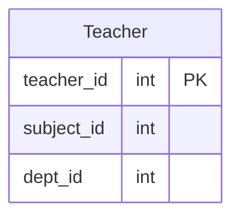

# leetcode : 2356. Number of Unique Subjects Taught by Each Teacher

* [[leetcode : 2356. Number of Unique Subjects Taught by Each Teacher]](https://leetcode.com/problems/number-of-unique-subjects-taught-by-each-teacher/description/)
<br>

---

### **다이어그램**


* `각 선생 별 과목 수 구하기`

<br>

## 문제 풀이

### **MySQL 1**
```SQL
SELECT teacher_id, COUNT(DISTINCT subject_id) as cnt
FROM teacher
GROUP BY teacher_id
```

* GRUOP BY + COUNT DISTINCT
  
### **MySQL 2**
```SQL
SELECT
    TEACHER_ID as teacher_id,
    COUNT(DISTINCT SUBJECT_ID) as cnt
FROM TEACHER
GROUP BY TEACHER_ID
```

* GRUOP BY + COUNT DISTINCT
* 대소문자좀 구별하지마라 좀!!
  
### **Pandas**
```python
def count_unique_subjects(teacher: pd.DataFrame) -> pd.DataFrame:
    grouped = teacher.groupby('teacher_id').agg(
        cnt = ('subject_id','nunique')
    ).reset_index()
    return grouped
```

* groupby + unique
  
### **Pandas**
```python
def count_unique_subjects(teacher: pd.DataFrame) -> pd.DataFrame:
    grouped = teacher.groupby('teacher_id').nunique().reset_index().rename(columns={'subject_id':'cnt'})
    return grouped[['teacher_id','cnt']]
```

* 한 컬럼에만 집계를 해주는거라 agg 대신 nunique를 사용해서 풀이.
  
<br>

### **코멘트**
* 기본문제
