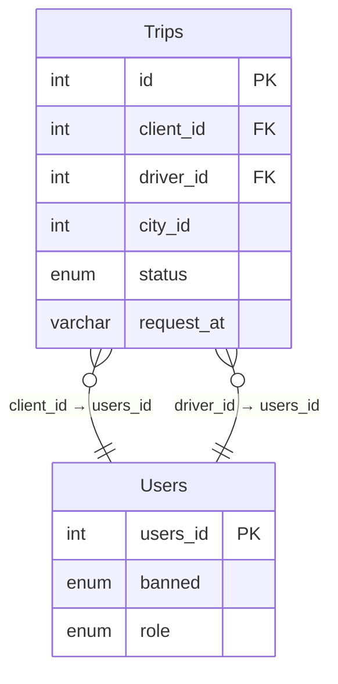

leetcode : 262. Trips and Users
===

* [[leetcode : 262. Trips and Users]](https://leetcode.com/problems/trips-and-users/description/)
<br>

---

### **다이어그램**


### **목표**
> The cancellation rate is computed by dividing the number of canceled (by client or driver) requests with unbanned users by the total number of requests with unbanned users on that day.
>
> Write a solution to `find the cancellation rate of requests with unbanned users (both client and driver must not be banned) each day between "2013-10-01" and "2013-10-03". Round Cancellation Rate to two decimal points.`
>
> `주어진 기간 내 취소율 소수점 두 자리수로 구하기.`

<br>

## **문제 풀이**

### **MySQL**
```SQL
-- Solution 1

-- 1. banned user : 유효하지 않음.
WITH BANNED AS (
    SELECT USERS_ID
    FROM USERS
    WHERE BANNED = 'Yes'
),

-- 2. 유효하지 않은 trip 가져오고, binary data로 status 변환
TEMP AS (
    SELECT T.CLIENT_ID,
            T.STATUS,
            T.REQUEST_AT,
            IF(STATUS='completed',0,1) AS STATUS_BIN
    FROM TRIPS T
    LEFT JOIN
        USERS U ON U.USERS_ID = T.CLIENT_ID
    WHERE
        CLIENT_ID NOT IN (SELECT USERS_ID FROM BANNED) AND
        DRIVER_ID NOT IN (SELECT USERS_ID FROM BANNED)
),

-- 3. 취소율 구하기
CANCLE_RATE AS (
    SELECT
        REQUEST_AT AS `Day`,
        ROUND(SUM(STATUS_BIN)/COUNT(*),2) AS `Cancellation Rate`
    FROM TEMP
    GROUP BY REQUEST_AT
)

-- 4. 날짜필터 구하기
SELECT `Day`, `Cancellation Rate`
FROM CANCLE_RATE
WHERE `Day` BETWEEN '2013-10-01' AND '2013-10-03'
```

* Solution 1
  * 일단 테이블부터 잘 이해해야한다.
  * Users에는 cliente, driver 모두 존재한다.
  * trips 테이블에서 둘 중 하나라도 ban이면 그 row는 유효하지 않아서 카운팅하지 않는다.
  * 먼저, Banned User를 CTE에 만들어놓고, 둘 다 최소되지 않은 row들을 where 조건으로 걸어준다.
  * 요일별 cancellation을 구하기 위해, IF문으로 취소됐으면 1, 아니면 0을 사용하고, 다음 CTE에서 sum/count로 비율을 구해준다.
  * 날짜 필터링 구해주기
  
  
### **Pandas**
```python
# Solution 1
def trips_and_users(trips: pd.DataFrame, users: pd.DataFrame) -> pd.DataFrame:
    
    unbanned = users[users['banned']=='No']

    cond1 = trips['client_id'].isin(unbanned['users_id'])
    cond2 = trips['driver_id'].isin(unbanned['users_id'])
    valid = trips[cond1&cond2]

    # np.where이 가독성이좀 더 좋아보인다. 조건을 걸어주는게 눈에 잘 보임, 변수부터 조건이긴 한데..
    # valid['status_bin'] = np.where(valid['status'] != 'completed', True, False)
    valid['status_bin'] = valid['status']!='completed'

    grouped = valid.groupby('request_at').agg(
        Cancellation = ('status_bin', lambda group: round(sum(group)/len(group),2))
    ).reset_index()
    cond3 = grouped['request_at'].between('2013-10-01','2013-10-03')
    return grouped[cond3].rename(columns={'request_at':'Day',
                                        'Cancellation':'Cancellation Rate'})
```


* 파이써닉하게 푼 거의 1등 코드~
* 마찬가지로 unbanned를 설정해주고, cond1 cond2로 각각 valid한 코드를 불러온다.
* grouped에서 lambda를 적용할 땐, 각 grouped의 DataFrame이 덩어리로 들어온다고 생각하면 편하다.
  
<br>

---


### **코멘트**
* 문제 잘 읽고, 테이블 그리면서 풀면 크게 어려운 문제는 아니다.
