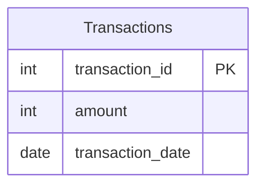

# leetcode : 3220. Odd and Even Transactions

* [[leetcode : 3220. Odd and Even Transactions]](https://leetcode.com/problems/odd-and-even-transactions/description/)
<br>

---

### **다이어그램**


* `각 날짜별 주문 AMOUNT 홀짝에 따른 합계`

<br>

## 문제 풀이

### **MySQL 1**
```SQL
SELECT transaction_date, SUM(IF (AMOUNT%2=1,AMOUNT,0)) AS ODD_SUM, SUM(IF (AMOUNT%2=0,AMOUNT,0)) AS EVEN_SUM
FROM transactions
GROUP BY transaction_date
ORDER BY 1 ASC
```

* GROUP BY + SUMIF 사용해주기.

### **MySQL 2**
```SQL
SELECT
    TRANSACTION_DATE,
    SUM(IF(AMOUNT%2=1,AMOUNT,0)) AS ODD_SUM,
    SUM(IF(AMOUNT%2=0,AMOUNT,0)) AS EVEN_SUM
FROM TRANSACTIONS
GROUP BY TRANSACTION_DATE
ORDER BY TRANSACTION_DATE
```

* SUM IF + GROUPBY + ORDER BY
  
### **Pandas 1**
```python
def sum_daily_odd_even(transactions: pd.DataFrame) -> pd.DataFrame:
    grouped = transactions.groupby('transaction_date').agg(
        odd_sum = ('amount', lambda df: df[transactions['amount']%2==1].sum()),
        even_sum = ('amount', lambda df: df[transactions['amount']%2==0].sum())
    ).reset_index()
    grouped.sort_values('transaction_date', inplace=True)
    return grouped
```

* group by + lambda sum
* groupby 이후 lambda로 받는 객체가 DataFrame이라 x로 표현하는거 보다 df로 표현하는게 더 좋은 것 같다.
* apply 시 lambda로 받을 때는 row가 들어오므로 x대신 row로 표현하는 습관 들이기.
  
### **Pandas 2**
```python
def sum_daily_odd_even(transactions: pd.DataFrame) -> pd.DataFrame:
    transactions = transactions.sort_values('transaction_date')
    grouped = transactions.groupby('transaction_date').agg(
        odd_sum = ('amount', lambda group: group[transactions['amount']%2==1].sum()),
        even_sum = ('amount', lambda group: group[transactions['amount']%2==0].sum())
    ).reset_index()
    return grouped
```

* 비슷하게 풀었는데, 미리 transactions를 정렬을 시킨다.
* 데이터프레임에서 순서도 유지시켜줄 것 같았는데 순서도 유지시켜줬다.
* 정렬되어있는 DataFrame에서 agg 속도가 더 빠를거같았는데, 예상대로 더 빠르게 동작한다.
  
<br>

### **코멘트**
* 이게 왜 미디엄?
